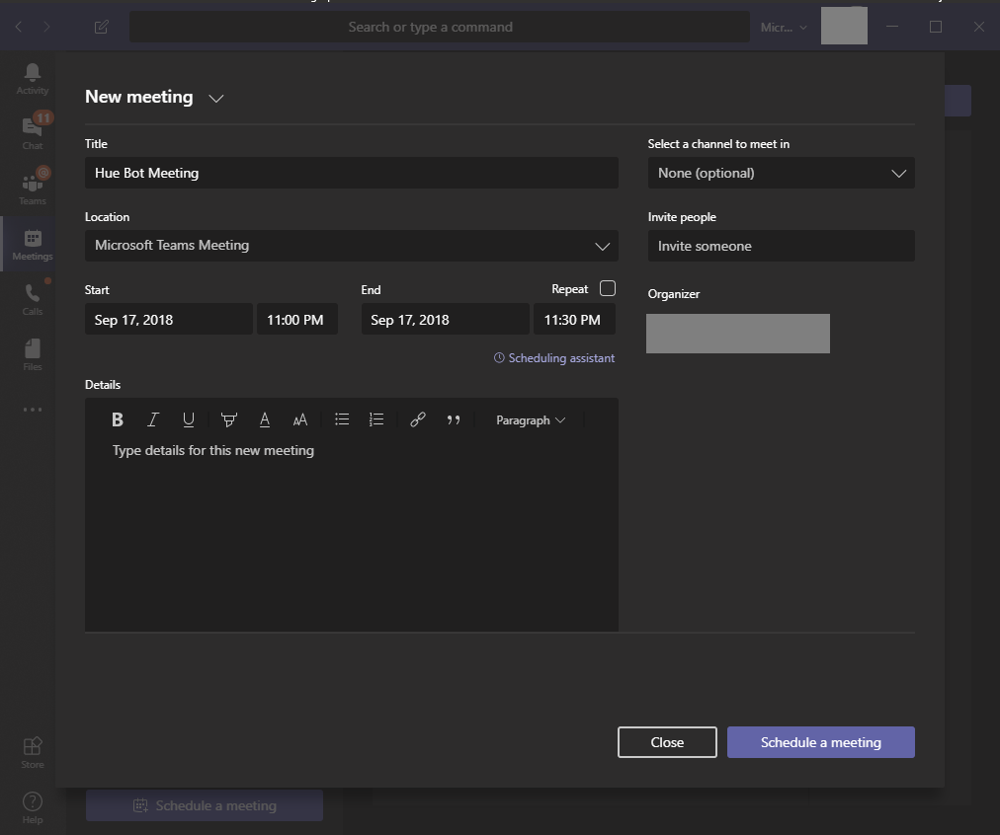

# Introduction

## About

The Compliance Recording bot sample guides you through building, deploying and testing a bot. This sample demonstrates how a bot can receive media streams for recording.

## Getting Started

This section walks you through the process of deploying and testing the sample bot.

### Prerequisites

* Install the prerequisites:
    * [Visual Studio 2017+](https://visualstudio.microsoft.com/downloads/)
    * [PostMan](https://chrome.google.com/webstore/detail/postman/fhbjgbiflinjbdggehcddcbncdddomop)

### Deploy

1. Create a cloud service (classic) in Azure. Get your "Site URL" from Azure portal, this will be your DNS name and CN name for later configuration, for example: `bot.contoso.com`.

1. Set up SSL certificate and upload to the cloud service
    1. Create a wildcard certificate for your service. This certificate should not be a self-signed certificate. For instance, if your bot is hosted at `bot.contoso.com`, create the certificate for `*.contoso.com`.
    2. Upload the certificate to the cloud service.
    3. Copy the thumbprint for later.

1. Set up cloud service configuration
    1. Open powershell, go to the folder that contains file `configure_cloud.ps1`. The file is in the same directory as `AudioVideoPlaybackBot.sln`
    2. Run the powershell script with parameters `.\configure_cloud.ps1 -p .\AudioVideoPlaybackBot\ -dns {your DNS name} -cn {your CN name, should be the same as your DNS name} -thumb {your certificate thumbprint} -bid {your bot name} -aid {your bot app id} -as {your bot secret}`, for example `.\configure_cloud.ps1 -p .\AudioVideoPlaybackBot\ -dns bot.contoso.com -cn bot.contoso.com -thumb ABC0000000000000000000000000000000000CBA -bid bot -aid 3853f935-2c6f-43d7-859d-6e8f83b519ae -as 123456!@#$%^`

1. Publish the bot from VS:
    1. Right click ComplianceRecordingBot, then click `Publish...`. Publish it to the cloud service you created earlier.

### Test

1. Set up the test meeting and test clients:
   1. Sign in to Teams client with a non-recorded test tenant user, and schedule a Teams meeting with the recorded user.
       
   1. Use another Teams client to sign in with the recorded user. (You could use an private browser window at https://teams.microsoft.com)

1. Join the meeting from the Teams client with the non-recorded user.

1. Invite the recorded user to the meeting. Your bot should now receive an incoming call, and join the call. (See next step for retrieving logs) Use the recorded user's Teams client to accept the call.

1. Interact with your service, _adjusting the service URL appropriately_.
    1. Get diagnostics data from the bot. Open the links in a browser for auto-refresh. Replace the call id 311a0a00-53d9-4a42-aa78-c10a9ae95213 below with your call id from the first response.
       * Active calls: https://bot.contoso.com/calls
       * Service logs: https://bot.contoso.com/logs

    1. Terminate the call through `DELETE`, as needed for testing. Replace the call id `311a0a00-53d9-4a42-aa78-c10a9ae95213` below with your call id from the first response.

        ##### Request
        ```json
            DELETE https://bot.contoso.com/calls/311a0a00-53d9-4a42-aa78-c10a9ae95213
        ```
