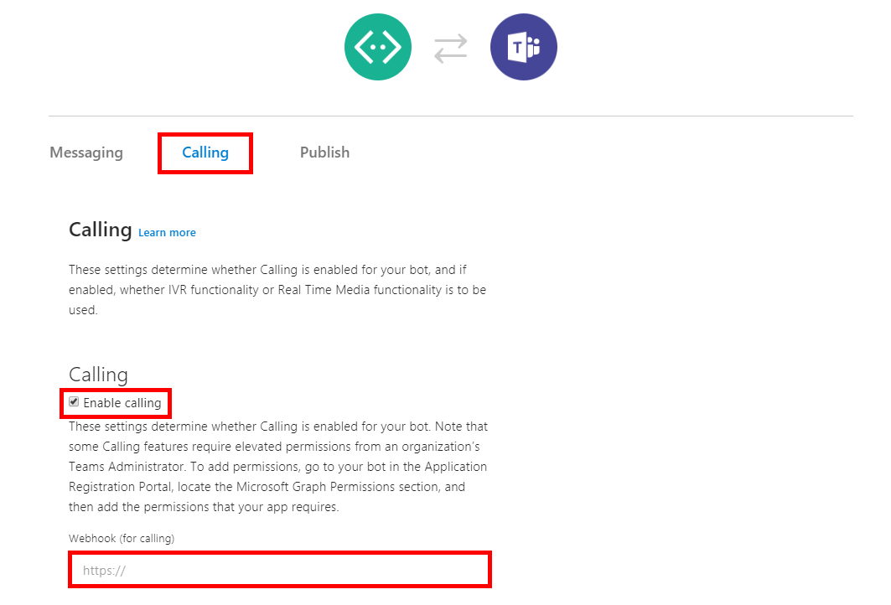

# Introduction

Local media samples give the developer direct access to the inbound and outbound media streams.  The 2 samples here are focused on different local media scenarios.

## AudioVideoPlaybackBot

This bot demostrates several features of local media scenarios:
- Plays a movie in multiple resolutions as the main video output feed.
- Listens to dominant speaker events and subscribes to inbound video feeds of those participants.
- Allows switching between screen viewing sharer and viewer, and publishes video through the screen sharing socket.

## HueBot

This bot demonstrates local media scenarios.
- Listens to dominant speaker events and changes the hue color of the dominant speaker video.

# Getting Started

1. [Create your new bot](https://dev.botframework.com/bots) and select the **Bot Channel Registrations** option.
2. Configure your channels and add the Microsoft Teams Channel.
3. In the Microsoft Teams Channel, enable *Calling* under Calling tab, and enter your callback URI to support incoming call scenarios.  
   - The callback URI will be based on your hosting configuration.  If you choose to run your bot locally via a proxy service such as ngrok and wish to support incoming call scenarios, please enter your ngrok URI here.
   - 
4. The permission needs to be consented by tenant admin. Go to "https://login.microsoftonline.com/common/adminconsent?client_id=<app_id>&state=<any_number>&redirect_uri=<callback_url>" using tenant admin to sign-in , then consent for the whole tenant.
5. Configure your permissions. Go to Settings page and click on the *Manage* link near *Microsoft App ID*. In the new page, click *Add* button after *Application Permissions* and select *Calls.AccessMedia.All*, and then save the change. If your bot also need to join meeting, select *Calls.JoinGroupCall.All* as well.
6. Please read the [Concepts](https://docs.microsoft.com/en-us/azure/bot-service/dotnet/bot-builder-dotnet-real-time-media-concepts?view=azure-bot-service-3.0) and [Requirements](https://docs.microsoft.com/en-us/azure/bot-service/dotnet/bot-builder-dotnet-real-time-media-requirements?view=azure-bot-service-3.0) articles for more in depth knowledge on local media bots.
7. Follow [Deploy your Bot](https://docs.microsoft.com/en-us/azure/bot-service/dotnet/bot-builder-dotnet-real-time-deploy-visual-studio?view=azure-bot-service-3.0) guide to publish your bot to the web.
8. Please read the [API Reference](https://sampleapps-microsoftteams.visualstudio.com/_git/GraphCommsSamples?path=%2FDocumentation%2Fapi-reference%2Fbeta) for specific API information.

# Build and Test

Before we build, we will need to gather all the configurations from the **Getting Started** guide.  The pieces of information that are needed are:
- The bot deployment DNS name from step 7.
- The bot deployment CName, usually same as DNS name.
- Your certificate thumbprint from step 7.
- The bot name from step 1.
- The bot app id/secret from step 1.  Once the bot is created you can go to the *Settings* section and then *Manage App Id* to generate your secret.

We have created a convenience script that will take all the information above and populate the configuration files.  Please run configure_cloud.ps1 and enter the above information.

To build, simply open the .sln file in question and build all.  Testing the bot can be done in 1 of 2 ways:

## Deploy the bot to a cloud service

If you choose to go down this route, please take a look at the deployment steps in the **Getting Started** guide.  In each local media solution we have also provided you with sample [Postman](https://www.getpostman.com/) requests you can use to talk to your bot deployment.

## Run your bot locally

To run your bot locally you will need to configure a local proxy.  [ngrok](https://ngrok.com/) is a great service that allows local proxy of both http (signalling) and tcp (media) traffic.  For more information please reference our [Local Testing Guide](http://graphcallingsdk-docs.azurewebsites.net/articles/Testing.html)

# Contribute
TODO: Explain how other users and developers can contribute to make your code better. 

If you want to learn more about creating good readme files then refer the following [guidelines](https://www.visualstudio.com/en-us/docs/git/create-a-readme). You can also seek inspiration from the below readme files:
- [ASP.NET Core](https://github.com/aspnet/Home)
- [Visual Studio Code](https://github.com/Microsoft/vscode)
- [Chakra Core](https://github.com/Microsoft/ChakraCore)
