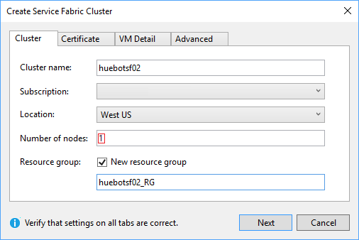
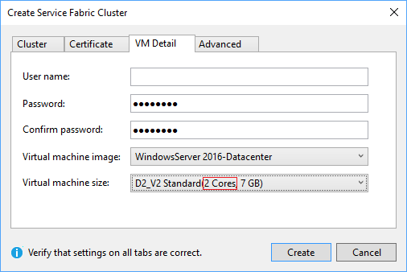
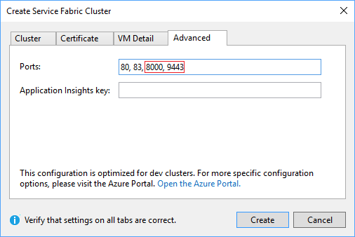

# Media bot on Azure Service Fabric

## About
The Hue Bot sample guides you through building, deploying and testing an application hosted media bot on Service Fabric. This sample demonstrates how bots can interact with users by enabling real-time video capabilities.

## Getting Started

### Bot Registration
1. Follow the steps in [Register Calling Bot](https://sampleapps-microsoftteams.visualstudio.com/_git/GraphCommsSamples?path=%2FDocumentation%2Fconcepts%2Fregister-calling-bot.md&version=GBmaster).  

1. Add the following Application Permissions to the bot:
  
    * Calls.AccessMedia.All
    * Calls.Initiate
    * Calls.JoinGroupCall.All
    * Calls.JoinGroupAsGuestCall.All

### Prerequisites

1. Install the prerequisites.
    * [Visual Studio 2017](https://visualstudio.microsoft.com/downloads/)
    * [Azure Service Fabric](https://docs.microsoft.com/en-us/azure/service-fabric/service-fabric-get-started)
    * [Azure CLI](https://docs.microsoft.com/en-us/cli/azure/install-azure-cli?view=azure-cli-latest)
    * [Azure PowerShell](https://docs.microsoft.com/en-us/powershell/azure/install-azurerm-ps?view=azurermps-6.8.1)
    * [PostMan](https://chrome.google.com/webstore/detail/postman/fhbjgbiflinjbdggehcddcbncdddomop)

1. Open the HueBotSF.sln in Visual Studio 2017 and search/replace these values:
    * `%AppId%` and `%AppSecret%` that you obtained during application registration.
    * `huebotsf02.westus.cloudapp.azure.com` with your service URL
    * Certificate thumbprint `ABC0000000000000000000000000000000000CBA` with your certificate.

### Setup Cluster

1. Right-click HueBotSF and select "Publish".

    Connection Endpoint, select "&lt;Create new cluster&gt;"
    
    

    For initial bootstrap, use only 1 node. For production, you need at least 3 nodes.

    

    Media bots require a minimum of 2 cores.

    

    Open ports 8000 (media) and 9443 (signaling).

    

1. Setup SSL certificate.
    Create a certificate for your service.  This certificate should not be a self-signed certificate.

    Upload the certificate to your key-vault instance.

    

    

    Copy the Secret Identifier

    

    Provision the SSL certificate as a secondary certificate to your cluster.  Please note that this step takes a long time to complete.

    ```cmd
     PS C:\Program Files\Microsoft SDKs\Azure\.NET SDK\v2.9> Connect-AzureRmAccount
     PS C:\Program Files\Microsoft SDKs\Azure\.NET SDK\v2.9> Select-AzureRmSubscription -SubscriptionId "<your-Azure-Subscription-id>"
     PS C:\Program Files\Microsoft SDKs\Azure\.NET SDK\v2.9> Add-AzureRmServiceFabricClusterCertificate -ResourceGroupName 'huebotsf02_RG' -Name 'huebotsf02' -SecretIdentifier 'https://huebotsf02...'
    ```

1. Update the code to the new SSL certificate and publish.

    

### Test

1. Schedule a Teams meeting with another person.

    

1. Copy the Join Microsoft Teams Meeting link. Depending on where you copy this, this may be encoded as a safe link in Outlook.

    

    Example, `https://teams.microsoft.com/l/meetup-join/19:cd9ce3da56624fe69c9d7cd026f9126d@thread.skype/1509579179399?context={"Tid":"72f988bf-86f1-41af-91ab-2d7cd011db47","Oid":"550fae72-d251-43ec-868c-373732c2704f","MessageId":"1536978844957"}`

1. Join the meeting from the Teams client and start up video.

1. Open HueBot.postman_collection.json in PostMan.  Edit the variables and set ServiceName to your bot service URL.

    1. Edit the `Join Meeting` payload with the join URL.  The bot will join the call and show up on the Teams client.
    1. Run `List Calls` to find out the currently active calls.  If the previous step failed for any reason, this will be empty.
    1. Click on the `hue` link in the List Calls output, edit it to be a `Put`, mark it as JSON body and put "green" as the payload. That will change the hue.
    1. Click on the `call` link and do a `GET` on it to get the state of the call. Calling `DELETE` on that link will remove the bot from the call.
