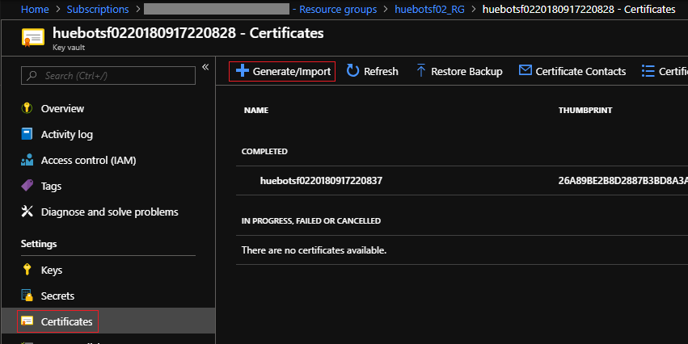
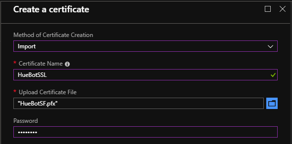
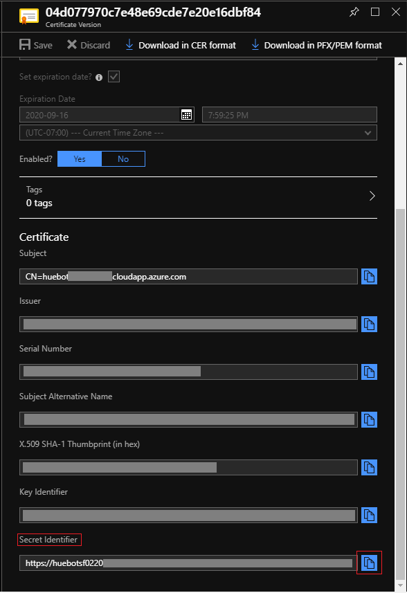
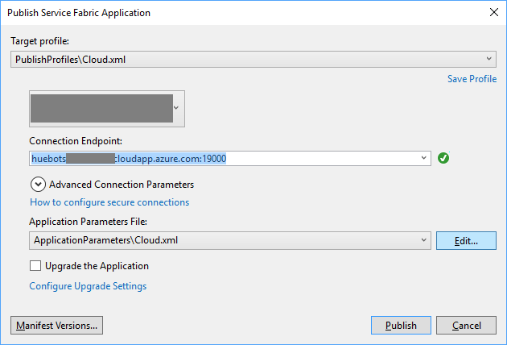
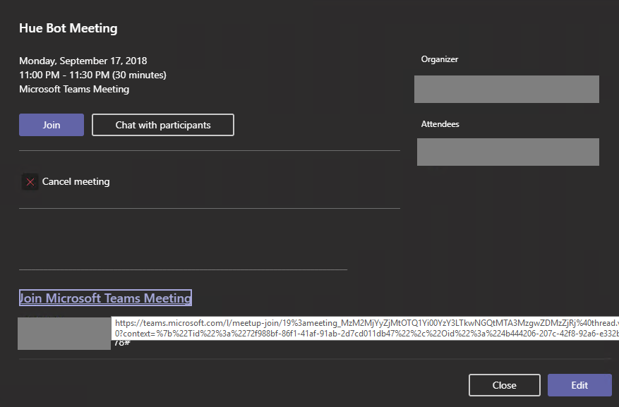

# Introduction

## About
The Hue Bot sample guides you through building, deploying and testing an application hosted media bot. This sample demonstrates how bots can interact with users by enabling real-time video capabilities.

## Getting Started
This section walks you through the process of deploying and testing the sample bot. You have 2 options: deploy to Azure, or run locally on your dev box. Many of the steps are common; wherever they do diverge, they have been specifically marked as **[Local]** or **[Azure]**.

For running locally, we need to use a tunneling mechanism to route traffic to your dev box. You can find the concepts documented [here](https://microsoftgraph.github.io/microsoft-graph-comms-samples/docs/articles/Testing.html). While the steps for running locally can seem a bit longer, the deployments are much faster and convenient for tweaking and playing with the samples.

### Bot Registration
1. Follow the steps in [Register Calling Bot](https://sampleapps-microsoftteams.visualstudio.com/_git/GraphCommsSamples?path=%2FDocumentation%2Fconcepts%2Fregister-calling-bot.md&version=GBmaster).  

1. Add the following Application Permissions to the bot:

    * Calls.AccessMedia.All
    * Calls.Initiate
    * Calls.JoinGroupCall.All
    * Calls.JoinGroupAsGuestCall.All

### Prerequisites

* Install the prerequisites:
    * [Visual Studio 2017](https://visualstudio.microsoft.com/downloads/)
    * [Azure Service Fabric](https://docs.microsoft.com/en-us/azure/service-fabric/service-fabric-get-started)
    * [Azure CLI](https://docs.microsoft.com/en-us/cli/azure/install-azure-cli?view=azure-cli-latest)
    * [Azure PowerShell](https://docs.microsoft.com/en-us/powershell/azure/install-azurerm-ps?view=azurermps-6.8.1)
    * [PostMan](https://chrome.google.com/webstore/detail/postman/fhbjgbiflinjbdggehcddcbncdddomop)
    * [Local] [ngrok](https://ngrok.com/)

* Set up SSL certificate:
    1. Create a certificate for your service. This certificate should not be a self-signed certificate.
        * [Local] Create a wildcard certificate. For instance, if your bot is hosted at `bot.contoso.com`, create the certificate for `*.contoso.com`.

    1. Upload the certificate to your key-vault instance.
        
        

    1. Copy the Secret Identifier to be used later.
        

    1. Install the certificate to the LocalMachine/My certificate folder on your dev machine, including the private keys.

* [Local] ngrok
    1. Sign up for a free ngrok account. Once signed up, go to the ngrok [dashboard](https://dashboard.ngrok.com/) and get your auth token.

    1. Create an ngrok configuration file `ngrok.yml` as follows:
        ```yaml
        authtoken: %replace_with_auth_token_from_dashboard%
        tunnels:
          signaling:
            addr: 9442
            proto: http
          media: 
            addr: 8000
            proto: tcp
        ```

    1. Start ngrok: `ngrok.exe start -all -config %replace_with_path_to_your_ngrok.yml%`. You will see an output like this:
        

    1. From **your** output, note the 3 values in the places marked in red above. From now on, we will call them by these names:
       * `9add54fe` - ngrok signaling prefix
       * `0` - ngrok media prefix
       * `18134` - ngrok media port

    1. Set up a DNS CNAME entry for `%replace_with_ngrok_media_prefix%.contoso.com` pointing to `%replace_with_ngrok_media_prefix%.tcp.ngrok.io`. Example: `0.contoso.com` to `0.tcp.ngrok.io`.

### Code

* Open the `HueBot.sln` in Visual Studio 2017 and search/replace these values:
    * `%AppId%` and `%AppSecret%` that you obtained during application registration.
    * `huebotsf02` with your cluster name.
    * Certificate thumbprint `ABC0000000000000000000000000000000000CBA` with your certificate.

### Deploy

#### [Azure] deployment

1. Set up SF cluster:

    Replace the strings wherever marked with `%replace_with_`, and then run the following script.
    ```Powershell
    $subscriptionName="%replace_with_azure_subscription_name%"
    $resourceGroupName="%replace_with_name_to_create%" # you can keep this same as cluster name for convenience
    $keyvaultName="%replace_with_azure_keyvault_name%"
    $parameterFilePath="%replace_with_path_to_repos_folder%\service-shared_platform_samples\LocalMediaSamples\HueBot\HueBot\ARM_Deployment\AzureDeploy.Parameters.json"
    $templateFilePath="%replace_with_path_to_repos_folder%\service-shared_platform_samples\LocalMediaSamples\HueBot\HueBot\ARM_Deployment\AzureDeploy.json"
    $secretID="%replace_with_secret_id_of_certificate_from_keyvault%"

    Connect-AzureRmAccount
    Select-AzureRmSubscription -SubscriptionName $subscriptionName

    Set-AzureRmKeyVaultAccessPolicy -VaultName $keyvaultName -EnabledForDeployment
    New-AzureRmServiceFabricCluster -ResourceGroupName $resourceGroupName -SecretIdentifier $secretId -TemplateFile $templateFilePath -ParameterFile $parameterFilePath
    ```

1. Publish HueBot from VS:

    

#### [Local] deployment

In the `HueBot.sln` you have open in VS, right-click `HueBotSF` project and select `Set as StartUp Project`.

Click `Start` on the top toolbar to deploy the sample to the local cluster.

### Test

1. Schedule a Teams meeting with another person.

    

1. Copy the Join Microsoft Teams Meeting link. Depending on where you copy this, this may be encoded as a safe link in Outlook.

    

    Example, `https://teams.microsoft.com/l/meetup-join/19:cd9ce3da56624fe69c9d7cd026f9126d@thread.skype/1509579179399?context={"Tid":"72f988bf-86f1-41af-91ab-2d7cd011db47","Oid":"550fae72-d251-43ec-868c-373732c2704f","MessageId":"1536978844957"}`

1. Join the meeting from the Teams client and start up video.

1. Open HueBot.postman_collection.json in PostMan.  Edit the variables and set ServiceName to your bot service URL.

    1. Edit the `Join Meeting` payload with the join URL.  The bot will join the call and show up on the Teams client. Note the `callHandlerPort` in the response.
    1. Open the `List Calls` request and change the port in the URL to the one returned in `callHandlerPort` to find out the currently active calls on that VM.  If the previous step failed for any reason, this will be empty.
    1. Click on the `hue` link in the List Calls output, edit it to be a `Put`, mark it as JSON body and put "green" as the payload. That will change the hue.
    1. Click on the `call` link and do a `GET` on it to get the state of the call. Calling `DELETE` on that link will remove the bot from the call.
