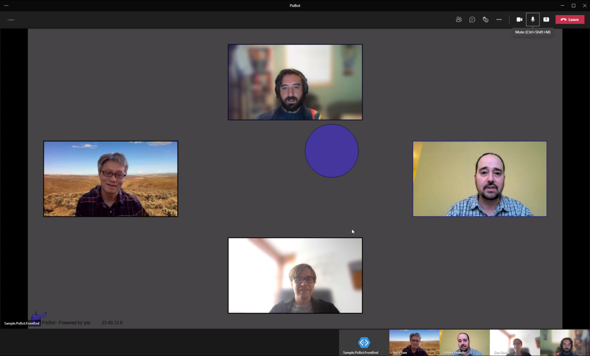
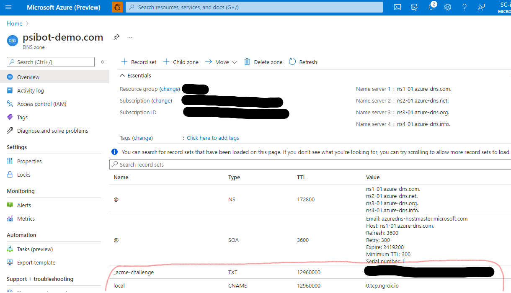
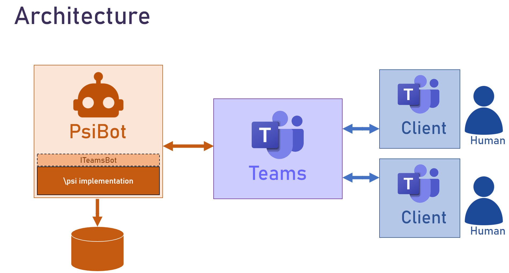
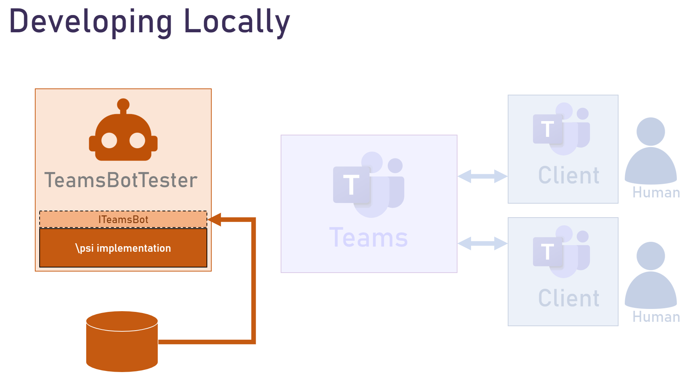
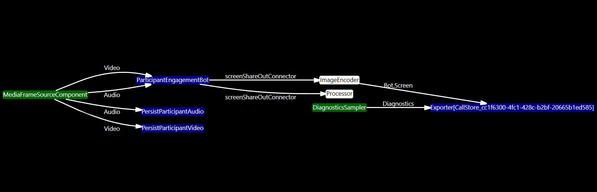

> **Note:**
> Public Samples are provided by developers from the Microsoft Graph community.
> Public Samples are not official Microsoft Communication samples, and not supported by the Microsoft Communication engineering team. It is recommended that you contact the sample owner before using code from Public Samples in production systems.

---

# Teams Bots with Platform for Situated Intelligence

**Description:** This sample application shows how you can integrate \psi with the Teams bot architecture to develop bots that can participate in live meetings.  
**Authors:** The \psi team at [https://github.com/microsoft/psi](https://github.com/microsoft/psi).  

---

# Introduction

Teams bots can be developed which participate in Teams meetings much the same way humans do; joining calls, consuming participant video and audio streams, and producing their own audio and video as well as screen sharing streams.

[Platform for Situated Intelligence (\psi)](https://github.com/microsoft/psi) is an open, extensible framework for development and research of multimodal, integrative-AI systems. The framework is particularly well-suited for developing AI systems that perform audio-visual processing in real-time interactions.

In order to help accelerate the development of Teams bots with real-time audio and video capabilities, we have created this sample application which shows how you can integrate \psi with the Teams bot architecture to develop bots that can participate in live meetings, [visualize and debug](https://github.com/microsoft/psi/wiki/Psi-Studio) your implementation, and iterate quickly offline from persisted data.

This is a sample Teams bot implementation, and may be used as a starting point for creating bots of your own with \psi. In particular, this sample consumes participant audio and video streams and visualizes engagement by producing a screen-share video stream with a ball gravitating towards the most recently active speakers (partially inspired by [this research](https://www.media.mit.edu/publications/meeting-mediator-enhancing-group-collaboration-and-leadership-with-sociometric-feedback/)). This sample was announced at a virtual Platform for Situated Intelligence workshop, and the recording of that session can be found [here](https://youtu.be/7Wh4Xr1Bazg?t=8582).




## Getting Started

If you are not familiar with Platform for Situated Intelligence, you'll first want to acquaint yourself with some of the fundamental concepts. The [GitHub page](https://github.com/microsoft/psi) has lots of documentation for familiarizing yourself with the framework, including a [wiki](https://github.com/microsoft/psi/wiki), [samples](https://github.com/Microsoft/psi-samples), [tutorials](https://github.com/microsoft/psi/wiki/Tutorials), and more. A great place to get started is the [Brief Introduction](https://github.com/microsoft/psi/wiki/Brief-Introduction) tutorial.

In the next steps, we'll walk through how to initialize your bot and other necessary resources in Azure. Following these instructions will enable you to execute the bot __on your local development machine__, but you should be able to follow similar steps to build and execute in an [Azure Virtual Machine](https://docs.microsoft.com/en-us/azure/virtual-machines/windows/quick-create-portal) (we recommend at least 4vCPU x 16Gib Memory).

### Bot Registration

1. Follow the steps in [Register Calling Bot](https://microsoftgraph.github.io/microsoft-graph-comms-samples/docs/articles/calls/register-calling-bot.html). Save the bot __name__, __app id__, and __app secret__ for configuration later.

1. Add the following Application Permissions to the bot:

    * Calls.AccessMedia.All
    * Calls.Initiate.All
    * Calls.JoinGroupCall.All
    * Calls.JoinGroupCallAsGuest.All
   
1. The permission needs to be consented by tenant admin. Go to "https://login.microsoftonline.com/common/adminconsent?client_id=<app_id>&state=<any_number>&redirect_uri=<any_callback_url>" using tenant admin to sign-in, then consent for the whole tenant.

### Prerequisites

#### On Windows

Visual Studio 2019 is required to build the `PsiBot.sln` solution on Windows.

__Setup Visual Studio 2019__:

Install [Visual Studio 2019](https://www.visualstudio.com/vs/). The Community Edition of Visual Studio is sufficient. Make sure the following features are installed (you can check these features by running the Visual Studio Installer again and looking at both the Workloads and Individual components tabs):

* Workloads:
  * __.NET desktop development__
  * __.NET Core cross-platform development__

### Local Run

#### Setup Custom Domain and SSL Certificate

1. If you don't already have one, you can purchase a domain name from Azure. This is like creating any other resource in the Azure portal. Create a resource called "App Service Domain" and give it a name (e.g., "mydomain.com").

2. Generate a SSL certificate for your domain. (You can get a free certificate from [LetsEncrypt](https://letsencrypt.org/))

    2.1. Install [certbot](https://certbot.eff.org/) and [openssl](https://www.openssl.org/) in your local Development Environment.
    
    2.2 Execute:
    ```
    certbot certonly --manual --preferred-challenges dns -d \*.<domain_name>
    ```
    to create the wildcard certificate for your domain, e.g., *.mydomain.com.

    2.3 The above command will ask to create a DNS TXT record under the name. Copy the TXT value (do not press enter).

    2.4. In your App Service Domain, [Create a TXT record](https://docs.microsoft.com/en-us/azure/app-service/app-service-web-tutorial-custom-domain#create-the-cname-record) by specifying:

        Name: _acme-challenge
        Type: TXT
        TTL: 3600
        Value: <as copied TXT value from Terminal>

    2.5 Go to the Terminal where certbot command was getting executed, and now press enter. The certificate should be created successfully, and note the path where the certificate files are present.

    2.6. Execute:
    ```
    openssl pkcs12 -export -out <certificate_name>.pfx -inkey <path_to_cert_files>/privkey.pem -in <path_to_cert_files>/cert.pem
    ```
    to create a `PKCS#12` format certificate, so that it can be imported into Windows.

3. Install the generated certificate into your system certificate manager. Look it up in the manager and take note of the THUMBPRINT for later.

4. In your App Services Domain, map the CNAME entry so any request to local.{mydomain}.com will be redirected to 0.tcp.ngrok.io.



#### Setup ngrok

1. Signup for a free [ngrok](https://ngrok.com/) account and get your auth token.

2. Create an ngrok config file as follows. Save it as, e.g., "ngrok.yml".
```yml
authtoken: YOUR_TOKEN
tunnels:
    signaling:
        addr: https://localhost:9441
        proto: http
    media:
        addr: 8445
        proto: tcp
```

3. Open a command prompt (you may need to run as an Administrator) and start ngrok: `ngrok start --all --config ngrok.yml`


4. Note down the following things from ngrok output

    - HTTP forwarding url (in this example: 87be4e797dbe.ngrok.io)
    - The port (in this example: 14211).

5. If you followed the above steps and only have one subdomain mapped to 0.tcp.ngrok.io, and if ngrok did not assign a 0.tcp address, then just re-run it until it does.

#### Edit Configuration File

To execute this PsiBot sample, you'll need to manually edit the `appsettings.json` file in the `PsiBot.Service` project:
```json
  "BotConfiguration": {
    "BotName": "<bot_name>",
    "AadAppId": "<app_id>",
    "AadAppSecret": "<app_secret>",
    "ServiceCname": "{ngrok-instance}.ngrok.io",
    "MediaServiceFQDN": "local.{mydomain}.com",
    "ServiceDnsName": "",
    "CertificateThumbprint": "CERTIFICATE_THUMBPRINT",
    "InstancePublicPort": <ngrok port>,
    "CallSignalingPort": 9441,
    "InstanceInternalPort": 8445,
    "PlaceCallEndpointUrl": "https://graph.microsoft.com/v1.0",
    "PsiStoreDirectory": "<optional directory for persisted store>"
  }
```

- Fill in the `ServiceCname` with ngrok's http address.
- Fill in `InstancePublicPort` with the ngrok tcp assigned port.
- `MediaServiceFQDN` is the subdomain URL that is forwared to the tcp URL assigned by ngrok (e.g., local.{mydomain}.com is forwarded to 0.tcp.ngrok.io).

#### Running the Bot

You should now have everything you need to run the bot and have it join a meeting.

1. In Visual Studio (you may need to run as an Administrator), run the [PsiBot.Service](./PsiBot/PsiBot.Service/PsiBot.Service.csproj) project (in Kestrel, not IIS Express).

2. Go to `{ngrok-instance}.ngrok.io/manage` in a browser, to have your bot join and leave specific meeting instances.

# Architectural Overview



The following projects comprise this sample:

- [**PsiBot**](./PsiBot/) - This is the bot itself. It contains boilerplate code that handles all the mechanics of hosting a Teams bot. This is also where we embed our \psi implementation (inside the [PsiBot.Service](./PsiBot/PsiBot.Service/) project).
- [**TeamsBot**](./TeamsBot/) - This project simply contains the `ITeamsBot` interface, which is used to create your \psi pipeline that can be plugged into the Teams bot infrastructure directly (i.e., as a drop-in replacement inside [PsiBot.Service](./PsiBot/PsiBot.Service/) or used in offline testing ([`TeamsBotTester`](./TeamsBotTester/)).
- [**TeamsBotSample**](./TeamsBotSample/) - Contains two sample implementations of the `ITeamsBot` interface. Both of these examples consume participant audio and video and visualize engagement by producing a screen-share video stream, either via a "bouncing ball" or by scaling video thumbnails.
- [**TeamsBotTester**](./TeamsBotTester/) - is an app to test `ITeamsBot` implementations offline from recorded data.



## Bot Code

The \psi-related code inside [PsiBot.Service](./PsiBot/PsiBot.Service/) can be found in a few different places.
- `CallHandler.cs` handles calls with the Teams bot APIs. This is also where we instantiate our \psi pipeline, an exporter to write to, and our `ITeamsBot` implementation. All of these are passed to a `BotMediaStream`.
- `BotMediaStream.cs` handles all input and output between Teams and \psi. It listens to various "media received" events and passes to a `MediaFrameSouceComponent`.
- `MediaFrameSourceComponent.cs` is the primary source component in the \psi pipeline comprising our bot implementation. It essentially converts Teams media buffers into standard \psi audio buffers and image types, which can then be consumed by our bot implementation (e.g., as implemented in [`TeamsBotSample`](./TeamsBotSample/)).

This is how the top-level pipeline is organized in this sample:



## Usage

The bot is configured to join, interact with, and record meetings. The easiest way to arrange such a meeting is to sign into the web-based Teams (teams.microsoft.com) in an In-Private/Incognito tab. The bot may be told to join the meeting by pasting the meeting link at the management page (e.g. {ngro-instance}.ngrok.io/manage (see [ManagementPageController.cs](./PsiBot/PsiBot.Service/Controllers/ManagementPageController.cs)). This page is also used to tell the bot to leave a meeting (otherwise the \psi store remains "live" forever). While in the meeting, the bot records to a \psi store specfied by `PsiStoreDirectory` in your `appsettings.json`.

Please remember to develop and deploy your own bots in a responsible manner. In this sample, the bot displays a notice informing participants that all meeting data is being recorded. This is a good practice to follow: always let people who join the meeting know that their audio/video data is being sent to the bot (and perhaps recorded), and inform them about what the bot is doing with that data. For other guidelines and best practices, please see [this publication](https://www.microsoft.com/en-us/research/publication/responsible-bots/).

## Known Issues

- Starting and stopping video doesn't resume the stream at the bot (leaving and rejoining does)
- Audio originating time may be 0 in the first 4-5 seconds of the call, or during various media events. See: https://microsoftgraph.github.io/microsoft-graph-comms-samples/docs/bot_media/Microsoft.Skype.Bots.Media.UnmixedAudioBuffer.html#Microsoft_Skype_Bots_Media_UnmixedAudioBuffer_ActiveSpeakerId