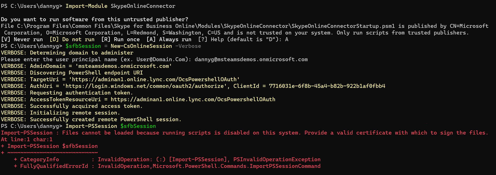

# Setting Local Environment Gotchas

## README.md

### Update configuration value

1. When running `runngrok.bat` file in Windows, the following error pops up on the screen:

```cmd
'REM' is not recognized as an internal or external command,
operable program or batch file. 
```

To fix that, I had to apply `dos2unix` command on this file.

2. After building the solution in Visual Studio 2019 and running in the debug mode, the RecordingBot.Console app exited with the Exception "Media platform failed to initialize" in Microsoft.Group.Communications.Calls.Media.dll in Program.cs at the line #72:

```c#
_botService.Initialize();
```

3. It seems like the step #5 on the line 175 in the Readme.md document is redundant when running docker in the command like. The script `.\entrypoint.cmd` is executed when the docker image starts running.

## Bot.md

### Bot Registration

During the Web platform configuration in the AD, the following are missing:

- The example of the redirect URI
- The instructions for either the implicit grant flow must be enabled or left untouched.

## Policy.md

### Create an Application Instance

1. When executing the following command: `Import-PSSession $sfbSession`, the following error occurred:


    Adding the following step before running the last command has solved this issue:
`Set-ExecutionPolicy RemoteSigned`. I've also updated the original document.

2. When adding new application instance, if the same user identity has already been previously associated with another application, the `New-CsOnlineApplicationInstance` command will fail. I've modified the document to anticipate this possible scenario.

## Source Files

1. There could be the mismatch between the hardcoded `DefaultPort` and the custom provided `AzureSettings__InstancePublicPort` in the `.env` file. It seems like the former is redundant. I've fixed it by adding a new Env var `AzureSettings__CallSignalingPort` and replacing all occurances of `DefaultPort` with `CallSignalingPort` in the `AzureSettings.cs` file. In addition, the `AzureSettings__InstancePublicPort` was repurpsed to hold the TCP forwarding port number.

