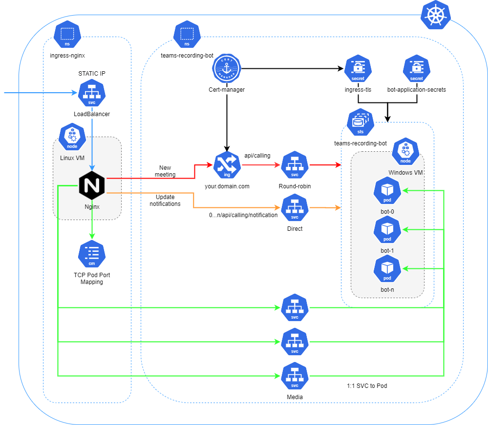

# Azure Kubernetes Services

The following documents the steps required to deploy the bot in Azure Kubernetes Services (AKS). The solution can run in a Kubernetes cluster with Windows VMs hosted elsewhere, but this document specifically outlines a deployment in AKS.

## TOC

1. [Setup](#Setup)
    - [Create an AKS cluster](#create-an-aks-cluster)
    - [Create and setup ACR](#create-and-setup-acr)
    - [Install cert-manager and nginx-ingress](#install-cert-manager-and-nginx-ingress)
    - [Set up DNS](#set-up-dns)
    - [Create Bot Channels Registration](#create-bot-channels-registration)
2. [Build and push Docker image](#build-and-push-docker-image)
3. [Deploy bot to AKS](#deploy-bot-to-aks)
4. [Concept: How bot works in Kubernetes](#concept:-how-bot-works-in-kubernetes)
5. [Validate deployment](#validate-deployment)
6. [Testing](#testing)
7. [Upgrading](#upgrading)
8. [Scaling](#scaling)
9. [Updating Docker Image](#updating-docker-image)
10. [Uninstalling](#uninstalling)

## Setup

### Create an AKS cluster

Before getting started, you need an AKS cluster deployed to Azure. For more detailed steps, see the AKS docs for [deploying an AKS cluster](https://docs.microsoft.com/en-us/azure/aks/kubernetes-walkthrough-portal). Keep the following in mind when creating the cluster:

- You will need a Windows VM Scale Set with more than 2 vCPU. If you deploy the bot to a VM that does not, the bot will not run. `Standard_DS3_v2` should be enough to get the bot running.
- By default, the bot deploys to a node pool called `scale`. If you call your node pool  something else, note down the name for future use.
- By default, the AKS cluster comes with a static IP address. Note down this IP address for future use.
  - If you do not have a static IP address, you can [deploy a static IP address](https://docs.microsoft.com/en-us/cli/azure/network/public-ip?view=azure-cli-latest#az-network-public-ip-create) with the `Standard` SKU in the **resource group your AKS deployment generated** (see [Create a static IP address](https://docs.microsoft.com/en-us/azure/aks/static-ip#create-a-static-ip-address)). This static IP needs to be associated to the Load Balancer created by AKS.
    To create a new IP address and then associate it with the AKS Load Balancer, use the following Azure CLI commands:

    ```powershell
    az network public-ip create `
        --resource-group <aks-generated-resource-group> `
        --name <give-name-to-IP> `
        --sku Standard `
        --allocation-method static
    ```

    Note down the public IP address, as shown in the following condensed example output:

    ```json
    {
      "publicIp": {
        ...
        "ipAddress": "40.121.183.52",
        ...
        }
    }
    ```

After creating the cluster, use the `az aks get-credentials` command to download the credentials for the Kubernetes CLI to use:

```powershell
az aks get-credentials --resource-group <name of resource group> --name <name of AKS cluster>
```

For more details, see the AKS docs for [connecting to the cluster](https://docs.microsoft.com/en-us/azure/aks/kubernetes-walkthrough#connect-to-the-cluster).

### Create and setup ACR

To store the bot Docker image, you need an Azure Container Registry (ACR). For more detailed steps, see the ACR docs for [creating a container registry](https://docs.microsoft.com/en-us/azure/container-registry/container-registry-get-started-portal).

Make sure you also integrate the ACR with AKS. For more detailed steps, see the AKS docs for [configuring ACR integration for existing AKS clusters](https://docs.microsoft.com/en-us/azure/aks/cluster-container-registry-integration#configure-acr-integration-for-existing-aks-clusters).

### Install cert-manager and nginx-ingress

In your cluster, you need to install `cert-manager` (which will manage TLS certificates for you) and `nginx-ingress`.

1. Modify [`cluster-issuer.yaml`](../../deploy/cluster-issuer.yaml) by adding a contact [email](../../deploy/cluster-issuer.yaml#L8).
2. Run the [`cert-manager.bat`](../../deploy/cert-manager.bat) script.
3. Run the [`ingress-nginx.bat`](../../deploy/ingress-nginx.bat) script.

>Note: After executing the last script `ingress-nginx.bat` and checking the status of the deployed kubernetes pods, you may see that the pod deployed into `ingress-nginx` namespace has either the `Error` or `CrashLoopBackOff` status. Don't worry, it is expected, because there's no default backend installed and the load balancer which will be installed in a later stage doesn't yet exist. Eventually, once you have deployed the bot, that `nginx` pod will work as expected.

### Set up DNS

You also need a custom domain that points to your AKS cluster. You can do this by creating a DNS A record pointing to the static IP address of your cluster. For example, you might end up with `subdomain.domain.com` pointing to `12.12.123.123`.

### Create Bot Channels Registration

If you haven't already done so, follow the instructions in [bot.md](../setup/bot.md) to register your bot in Azure. For the calling webhook, point it to the `/api/calling` endpoint of your domain (for example, `https://subdomain.domain.com/api/calling`). If you had already created a Bot Channels Registration for local development, be sure to update the calling webhook.

## Build and push Docker image

Next, you need to build the Docker image of the bot. If you followed the [main README steps for running in Docker](/README.md#Docker), you may have already built the image. Otherwise, run the following command from the root of the repo:

```powershell
docker build `
    --build-arg CallSignalingPort=<CALL_SIGNALING_PORT> `
    --build-arg CallSignalingPort2=<CALL_SIGNALING_PORT+1> `
    --build-arg InstanceInternalPort=<INSTANT_INTERNAL_PORT> `
    -f ./build/Dockerfile . `
    -t [TAG]
```

>where:
[TAG]: youracrname.azurecr.io/teams-recording-bot:[image-version]

The tag provided to `-t` above follows the format expected by `deployment.yaml`. If you use a different tag, be sure to modify `deployment.yaml` accordingly.

Once the image is built, push the image to your ACR by first logging into ACR:

```powershell
az acr login --name youracrname
```

and then pushing the image:

```powershell
docker push youracrname.azurecr.io/teams-recording-bot:1.0.0
```

For more details, see the ACR docs on [pushing and pulling images](https://docs.microsoft.com/en-us/azure/container-registry/container-registry-get-started-docker-cli).

## Deploy bot to AKS

Create the namespace that your bot will deploy into, and create a secret that contains values required to run the bot:

```powershell
kubectl create ns teams-recording-bot

kubectl create secret generic bot-application-secrets `
    --namespace teams-recording-bot `
    --from-literal=applicationId='BOT_ID' `
    --from-literal=applicationSecret='BOT_SECRET' `
    --from-literal=botName='BOT_NAME'
```

**Note**: Replace `BOT_ID`, `BOT_SECRET` and `BOT_NAME` with values from your bot registration (see [bot.md](../setup/bot.md)).

Now you can deploy the bot into this namespace. From the root of this repository, run the following command to install the bot in your AKS cluster:

```powershell
helm install teams-recording-bot ./deploy/teams-recording-bot `
    --namespace teams-recording-bot `
    --create-namespace `
    --set host="HOST" `
    --set public.ip=STATIC_IP_ADDRESS `
    --set image.domain=YOUR_ACR_DOMAIN
```

**Note**:

* `HOST` should be your domain (e.g. `subdomain.domain.com`).
* `STATIC_IP_ADDRESS` should be the static IP address associated with your AKS cluster's load balancer.
* `YOUR_ACR_DOMAIN` should be the container registry to which you pushed the Docker image (e.g. `youracrname.azurecr.io`).
* By default the bot deploys to a node pool with the name `scale`. If you did not call your node pool `scale`, you will need to override `node.target` using `--set node.target=NAME_OF_NODEPOOL`.

## Concept: How Bot works in Kubernetes

This section details on how the bot works in Kubernetes, what is deployed and how to safely scale.



### What is deployed

Deployed          | What it is responsible for
----------------- | --------------------------
Ingress           | This is used to route TCP traffic to the pods. Traffic is round-robin to the next available pod.
Headless Service  | Provides the ability to direct traffic to a specific pod in the StatefulSet.
ConfigMap         | TCP port mapping used to map public ports on the external load balancer to an a specific pod ClusterIP service.
LoadBalancer      | External facing. Has ports opened for both HTTPS and TCP traffic.
StatefulSet       | The bot container.
ClusterIP Service | TCP media traffic. Sits in front of the StatefulSet and routes media to the pods.

### How it ties together

The following is a breakdown of each component and how they join together.

#### External Load Balance

Using `.Values.public.media` as the starting point, helm iterates `.Values.scale.maxReplicaCount` number of times, and exposes `.Values.public.media` + current iteration to the internet. This is so each pod deployed in the StatefulSet has its own public TCP port for Teams to send media to.

Port 443 is exposed for standard HTTPS traffic to route to each pod.

This external load balancer is used by Ingress-Nginx and is called `ingress-nginx-controller`. If you are installing Ingress-Nginx using Helm, it is important that it does not also deploy an external load balancer by using `--set controller.service.enabled=false` so that Ingress-Nginx uses the load balancer that's deployed and configured by the `teams-recording-bot` Helm chart.

#### Ingress

Once ingress is deployed, it is responsible for routing HTTPS traffic to pods in the StatefulSet. Incoming traffic signalling a bot to join a meeting is round-robin to the next available pod in the StatefulSet using the `teams-recording-bot-routing` headless service.

Once a bot answers the request and joins the meeting, the bot then gives Teams a special URL to send notifications to. This special URL is parsed in the ingress using NGINX server-snippets and sends traffic directly to the targeted pod, bypassing the round-robin.

The following is an example of how this is done:

```yaml
nginx.ingress.kubernetes.io/server-snippet: |
    location ~* ^/(?<instance>[0-9]*)/api/calling/notification {
        proxy_pass https://{{ $fullName }}-$instance.{{ $fullName }}.{{ $namespace }}.svc.cluster.local:{{ .Values.internal.port }};
    }
```

* Example request: `https://bot.com/0/api/calling/notification`
* Using regex, we parse `instance` which correlates to the pod's [ordinal index](https://kubernetes.io/docs/concepts/workloads/controllers/statefulset/#ordinal-index). In the example above, `instance` would equal `0`.
   * If this regex is not satisfied, traffic is not intercepted meaning it is able to be round-robin to the next available pod.
* Using `proxy_pass`, we're able to redirect the traffic to the specific pod using the internal address which is provided using the [headless service](https://kubernetes.io/docs/concepts/workloads/controllers/statefulset/#stable-network-id).
    * `{{ $fullName }}` comes from the name of the Helm chart. In our case that would be `teams-recording-bot` and is rendered when deployed using Helm.
    * `{{ .Values.internal.port }}` unless specified, defaults to `9441`.
    * In our example, the `proxy_pass` URL would be: `https://teams-recording-bot-0.teams-recording-bot.teams-recording-bot.svc.cluster.local:9441`.

#### Headless Services

There are two different headless services deployed. These headless services are more or less identical but are used for different scenarios.

- `teams-recording-bot-routing` - responsible for routing the initial call to an available pod, instructing the bot to join a call.
- `teams-recording-bot` - responsible for routing updates to specific pod in the StatefulSet based on the incoming request.

**Note**: we use two headless services for routing HTTPS requests to pods to help with down scaling the bots.

#### ClusterIP Service

One ClusterIP Service is deploy for each pod deployed using `.Values.scale.maxReplicaCount`. Each service points to a specific pod in the StatefulSet. This service is responsible for routing TCP traffic to the pod.

Each service exposes and maps `.Values.internal.media` to the pod in the StatefulSet.

#### ConfigMap

A ConfigMap is used to bind the external TCP port exposed by the external load balancer to a specific pod in the StatefulSet. To do this, when deploying Ingress-Nginx it is important to pass an argument to the container telling the bot where to find the ConfigMap. If you're deploying Ingress-Nginx using Helm, you can do this with `--set controller.extraArgs."tcp-services-configmap"=teams-recording-bot/tcp-services`.

When deploying, Helm iterates `.Values.scale.maxReplicaCount` number of times, and creates an entry for `.Values.public.media` + current iteration, mapping it to a specific ClusterIP Service and `.Values.internal.media`.

The end result is something like this:

```yaml
28550: teams-recording-bot/teams-recording-bot-0:8445
```

#### StatefulSet

The bot deploys using a StatefulSet. The reason for this is predictable pod names as pods in a StatefulSet are ordinal indexed and StatefulSets make it easy to do things like rolling updates.

### How scaling works

This section describes both scaling up and scaling down.

#### Scaling up

Scaling up is pretty easy. When scaling up all you need to do is increase `.scale.replicaCount` and let Helm take care of the rest.

The main thing that happens when increasing `.scale.replicaCount` is:

* The StatefulSet is updated and new pods begin to spin up.

If you want to deploy more bots than what `scale.maxReplicaCount` allows, increasing `scale.maxReplicaCount` will do the following:

* New ports are opened up on the external load balancer.
* Additional ClusterIP services are added for each additional pods.
* The ConfigMap `tcp-services` is updated with mapping between the newly added ports and ClusterIP services.

The reason for separating scaling pods from scaling the services which support routing media is so that we can ensure the services will remain active while scaling down. This also helps if you want to implement auto scaling through something like [Horizontal Pod Autoscaler](https://kubernetes.io/docs/tasks/run-application/horizontal-pod-autoscale/).

#### Scaling down

Scaling down is a bit tricky. There's a couple issues we face when scaling down.

* If a pod is in a meeting, we need to make sure the pod is not forcefully terminated before the meeting finishes on its own.
* If a pod is terminating, we don't want new calls being assigned to that pod.
* When a pod is marked for termination, that pod's endpoints are removed from all services. This means even if we are able to keep the pod alive, we would not be able to route update notifications to the pod using the headless service and NGINX server-snippet.

To get around pods terminating before the call has ended is through a combination of `terminationGracePeriodSeconds` and `preStop` hooks. When used together, we can keep the pods alive for as long as we want without risk of encountering a `SIGKILL` signal. 

In our `preStop` hook, we run a little script called [halt_termination.ps1](../../scripts/halt_termination.ps1). This script calls `http://localhost:9442/calls` (an API endpoint built into the bot), and if the response is empty, there are no ongoing calls and the script exits allowing the pod to finish terminating. However, if the response is not empty, that indicates the pod is currently in an ongoing meeting so the script then sleeps for 60 seconds before trying again.

**Note**: if you set `terminationGracePeriodSeconds` too low you risk running out of time which results in the pod being forcefully removed.

So that gets around the pod forcefully terminating but that doesn't fix the issue of the pod's endpoints getting removed from all services. For that we set `publishNotReadyAddresses` to `true` in one of our headless services. This prevents the terminating pod's endpoints from getting removed from that headless service. This in turn allows the NGINX server-snippet to continue routing update notification HTTPS traffic to the pod even while it is terminating!

This is also why we have two headless services to route HTTPS traffic to the pods. One headless service is strictly to round-robin new requests for a bot to join a meeting while the other is used to route update notifications directly to the desired pod. When the pod is marked from termination, that pod's endpoint is removed from the headless service that round-robins requests to an available pod preventing new calls going to that terminating pod, while leaving that pod's endpoints reachable by the headless service with `publishNotReadyAddresses` set to `true`.

To scale down, decrease `scale.replicaCount` while leaving `scale.maxReplicaCount` as is. If you want to decrease `scale.maxReplicaCount`, make sure you do so after decreasing `scale.replicaCount` and waiting for there to be no pods in a `terminating` state.

## Validate deployment

You can validate that the `cert-manager` and `ingress-nginx` pods are running properly by checking the pods' statuses:

```powershell
kubectl get pods -n cert-manager
kubectl get pods -n ingress-nginx
```

which should show the pods running:

```
NAME                                   READY   STATUS    RESTARTS   AGE
cert-manager-abcdefg                   1/1     Running   0          10m
cert-manager-cainjector-tuvwxyz        1/1     Running   0          10m
cert-manager-webhook-1234567           1/1     Running   0          10m
```

```
NAME                                                 READY   STATUS    RESTARTS   AGE
nginx-ingress-ingress-nginx-controller-abcdefg       1/1     Running   0          10m
```

Also validate the ingress controller service:

```powershell
kubectl get svc -n ingress-nginx
```

which should show the configured static IP and open ports:

```
NAME                                     TYPE           CLUSTER-IP    EXTERNAL-IP     PORT(S)                                                                      AGE
nginx-ingress-ingress-nginx-controller   LoadBalancer   10.0.101.71   12.123.12.123   80:31871/TCP,443:31066/TCP,28550:30992/TCP,28551:32763/TCP,28552:31163/TCP   10m
```

Next, validate that the certificate was properly issued:

```powershell
kubectl get cert -n teams-recording-bot
```

which should show the issued certificate as "ready":

```
NAME          READY   SECRET        AGE
ingress-tls   True    ingress-tls   10m
```

Finally, you can check the `teams-recording-bot` pods:

```powershell
kubectl get pods -n teams-recording-bot
```

which should show the 3 bot pods as "running":

```
NAME                    READY   STATUS    RESTARTS   AGE
teams-recording-bot-0   1/1     Running   1          10m
teams-recording-bot-1   1/1     Running   1          10m
teams-recording-bot-2   1/1     Running   1          10m
```

**Note**: There may be a different number of pods if you changed the `scale.replicaCount` in `values.yaml`.

## Testing

After all kubernetes services and pods are up and running, it is a good idea to test that your bot can actually join the Microsoft Teams meeting and properly record audio streams.
To do that, you'd need to follow these steps:

1. Create a Teams Meeting Recording Policy for your Bot and assign it to the test user as  instructed in [Policy.md](../setup/policy.md).

2. Join the meeting with a test user (that has the Teams Meeting Recording Policy assigned to) and verify that the recording has automaticaly started (you should see the user consent disclaimer that the recording has started).

3. Either install the [Kubernetes Tools](https://marketplace.visualstudio.com/items?itemName=ms-kubernetes-tools.vscode-kubernetes-tools) extension for your Visual Studio Code or use the command line utility `kubect` to find which of your pods is currently serving the Recording bot. If you use the VSC extension, simply open the Kubernetes tab, then find the pods under `teams-recording-bot` namespace, right click on each of them (if you have more than 1 replica) and select `Show Logs`.
And if you use `kubect` command line utility, execute the following commands:

1.Get Pods

```powershell
kubectl get pods -n teams-recording-bot 
```

You'd see something like this output:

```cmd
NAME                    READY   STATUS    RESTARTS   AGE
teams-recording-bot-0   1/1     Running   0          13h
teams-recording-bot-1   1/1     Running   0          13h
teams-recording-bot-2   1/1     Running   0          13h
```

2.Obtain logs for each pod

```powershell
kubectl logs -n teams-recording-bot teams-recording-bot-{X}
```

>where {X} is the number of your pods. 

For example: `teams-recording-bot-0`

Eventually, you will find that one of your pods have the logs describing that your bot has successfully joined (or failed to join) the meeting. In the former case, you'd see something like this:

```cmd
Setup: Starting VC_redist
Setup: Converting certificate
Setup: Installing certificate
Certificate "avbotaks.msftdevtest.com" added to store.

CertUtil: -importPFX command completed successfully.
Setup: Deleting bindings
Setup: Adding bindings
Setup: Done
---------------------
RecordingBot: booting
RecordingBot: running
Skipped publishing IncomingHTTPPOST events to Event Grid topic recordingbotevents - No topic key specified
Skipped publishing NotificationHTTPPOST events to Event Grid topic recordingbotevents - No topic key specified
Skipped publishing CallEstablishing events to Event Grid topic recordingbotevents - No topic key specified
Skipped publishing NotificationHTTPPOST events to Event Grid topic recordingbotevents - No topic key specified
Skipped publishing CallEstablishing events to Event Grid topic recordingbotevents - No topic key specified
Skipped publishing NotificationHTTPPOST events to Event Grid topic recordingbotevents - No topic key specified
Skipped publishing CallEstablished events to Event Grid topic recordingbotevents - No topic key specified
Skipped publishing CallRecordingFlip events to Event Grid topic recordingbotevents - No topic key specified
```

3.Obtain the recorded audio files
After finishing the test MS Team meeting, you'd need to obtain the location and the file name of the zip file containing the audio stream produced by the Recording Bot on one of your AKS pods. To do that, you'd need to connect and create a PowerShell session on that pod. For simplicity, let's assume that your Bot is currently serving your Teams meeting on the Pod #1.

```powershell
kubectl exec -it teams-recording-bot-1 -n teams-recording-bot -- powershell.exe
```

When connected, you should see the PowerShell command line inside of your pod:

```cmd
Windows PowerShell
Copyright (C) Microsoft Corporation. All rights reserved.

PS C:\bot>
```

From there, navigate to the `C:\Users\ContainerAdministrator\AppData\Local\Temp\teams-recording-bot` directory should be existed on your pod and check what sub-folders exist underneath. You should be able to find the sub-folder with the name `archive`, and then, after inspecting it, you should find the folder containing the archived, zip file you need to take a full path of.

To get the recorded audio files copied from your AKS pod into your local machine, you can use the `kubectl` `cp` command:

```powershell
kubectl cp -n teams-recording-bot teams-recording-bot-{pod-#}:{path-to-zip} ./{local-zip}
```

where:

>- {pod-#}: Your pod number containing the audio files.
>- {path-to-zip}: The path to the source zip file on your Pod excluding the drive letter sign
>- {local-zip}: The local file name to the destination zip file.

For example, your command may look something like this:

```powershell
kubectl cp -n teams-recording-bot teams-recording-bot-1:/Users/ContainerAdministrator/AppData/Local/Temp/teams-recording-bot/archive/3c608c13-e57d-4aa1-bb6f-f153a12e0a05/c133ccdf-0abb-41ca-9134-0203f5c6c797.zip ./audio.zip
```

Now you can inspect the archived zip file on your local drive and check that it contains the audio stream was recorded during your test Teams Meeting.

## Upgrading

Upgrades are handled through helm. To upgrade the bot in your cluster, pull the latest changes and run the following command from the root of this repository:

```powershell
helm upgrade teams-recording-bot ./deploy/teams-recording-bot `
    --namespace teams-recording-bot `
    --set host="HOST" `
    --set public.ip=STATIC_IP_ADDRESS `
    --set image.domain=YOUR_ACR_DOMAIN
```

## Scaling

You can manually scale the bot by increasing the `scale.replicaCount`. Run the following command from the root of this repository:

```powershell
helm upgrade teams-recording-bot ./deploy/teams-recording-bot `
    --namespace teams-recording-bot `
    --set host="HOST" `
    --set public.ip=STATIC_IP_ADDRESS `
    --set scale.replicaCount=2
```

**Note**: `scale.replicaCount` cannot be greater than `scale.maxReplicaCount`. If you need to deploy more bots then be sure to also use `--set scale.maxReplicaCount=SOME_GREATER_NUMBER`.

## Updating Docker Image

After making new changes to the application code, you need to follow these steps to also update and release your new code into Azure Kubernetes Service:

1. Build the container, by opening a new powershell terminal and make sure you've changed directories to the root of this repository. If you are, run the following command:

    ```powershell
    docker build `
        --build-arg CallSignalingPort=<CALL_SIGNALING_PORT> `
        --build-arg CallSignalingPort2=<CALL_SIGNALING_PORT+1> `
        --build-arg InstanceInternalPort=<INSTANT_INTERNAL_PORT> `
        -f ./build/Dockerfile . `
        -t [TAG]
    ```

    >Note: the `[TAG]` should correspond to the tag was given to the Docker image deployed to your Azure Container Registry: `youracrname.azurecr.io/teams-recording-bot:[new-version-number]`

2. Push the new image into Azure Container Registry:

```powershell
az acr login --name youracrname
```

and then pushing the image:

```powershell
docker push youracrname.azurecr.io/teams-recording-bot:[new-version-number]
```

3. When updating the docker image, you must also update the application version specified in the [Chart.yaml](../deploy/teams-recording-bot/Chart.yaml). This version number should be incremented each time you make changes to the application.
Then, you simply re-run the Helm Chart upgrade command in order to update your AKS cluster pods:

```powershell
helm upgrade teams-recording-bot ./deploy/teams-recording-bot `
    --namespace teams-recording-bot `
    --set host="HOST" `
    --set public.ip=STATIC_IP_ADDRESS `
    --set image.domain=YOUR_ACR_DOMAIN
```

>where:
- YOUR_ACR_DOMAIN is your full path to your ACR registry (e.g. `youracrname.azurecr.io`)
- STATIC_IP_ADDRESS is your public static IP address attached to the AKS Load Balancer

## Uninstalling

```powershell
helm uninstall teams-recording-bot --namespace teams-recording-bot

kubectl delete ns cert-manager

kubectl delete ns ingress-nginx
```
