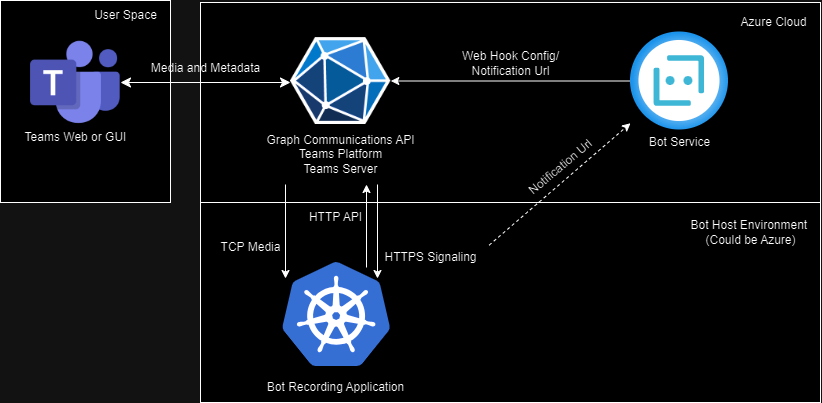

# High Level Overview

As seen in the image Teams clients communicate with the Teams Server / Teams Communication Platform. When a user under compliance recording policy initiates a call in its teams client, the Teams platform gets the https notification Url from a Bot Service that is linked to the Compliance Recording Policy. The Teams Platform uses the notification url to do a authorized http call to the Bot Recording Application, informing about the user initiating a call, authorization is done with a JWT token in the headers.

> [!IMPORTANT]
> The notification Url must be HTTPS and the Certificate used must be signed by a valid Authority.

When the Recording Application receives the Http Request, that a user is about to join a call, from the Teams Platform, the Recording Application should send an Answer to the Teams Platform via the Graph Communications API within this Answer the Recording application has to give a TCP Endpoint, can specify configuration and can change the notification url for the further notifications regarding the call that should be recorded. Further Notifications are send for everytime a user joins, mutes, starts a screen sharing and a lot of more actions users can do in a meeting.

> [!IMPORTANT]  
> The TCP endpoint also requires a Certificate signed by a Valid Authority.

On the TCP endpoint a Connection is opened by the Teams platform and a handshake for Authorization and Encryption is completed.

The overhead of the TCP endpoints is completly managed by the Microsft SDK for Bots, building an endpoint for receiving the Http Notifications (new calls and any updates) by the Teams Platform must implemented by the recording application. But parsed responses should be forwarded to the SDK which then fires event handlers based on the notifications, these event handlers then can implement business logic. For Example an event handler for answering calls is required and must use a method of the SDK(`Answer`) with some parameters (how should the TCP Endpoint be configured, how many video sockets should be created, should the notification url change etc.). But before that business logic can decide if the call should be answered or if the user is not allowed to do the call(with a less strict compliance recording policy it is also possible to just not record then), in that case a method of the SDK can also be used (`Reject`).

So a lot of overhead and Endpoint Handling is taken care of by the Microsoft SDK for Bots. But the SDK also has to be configured with a valid Certificate, the TCP Endpoint Configuration(DNS Name and port) and App Registration Id and Secrect of the Bot Service with the permissions.

> [!NOTE]
> The Application requires some Application Permissions to be able to answer calls and access media from calls, see the [Application Permissions Page](./application-permission) for reference.
