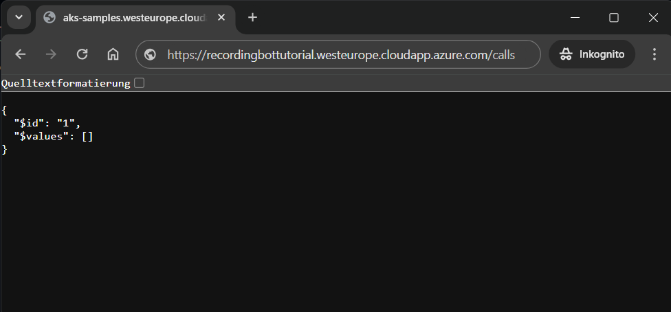

# Deploy recording bot sample to AKS cluster

To start our deployment we first make sure that we are still in the correct folder, if we did not
change the directory since building the Docker container we can continue with [deploying cert manager](#deploy-cert-manager)

```powershell
cd C:\Users\User\recordingbottutorial
```

And change the directory to the sample project in the repository.

```powershell
cd .\aks-sample\Samples\PublicSamples\RecordingBot\
```

## Deploy Cert Manager

Like any local media bots, the sample needs a properly signed certificate, with a trust chain up to
generally trusted root authority. To create the certificate for the sample in our AKS cluster
we use cert manager with [Let's Encrypt](https://letsencrypt.org/).

To deploy cert manager we run:

```powershell
cmd.exe /c '.\deploy\cert-manager\install.bat'
```

The result should look similar to:

```text
Updating helm repo
Hang tight while we grab the latest from your chart repositories...
...Successfully got an update from the "jetstack" chart repository
Update Complete. ⎈Happy Helming!⎈
Installing cert-manager
Release "cert-manager" does not exist. Installing it now.
NAME: cert-manager
LAST DEPLOYED: Wed Apr 24 09:56:58 2024
NAMESPACE: cert-manager
STATUS: deployed
REVISION: 1
TEST SUITE: None
NOTES:
cert-manager v1.13.3 has been deployed successfully!

In order to begin issuing certificates, you will need to set up a ClusterIssuer
or Issuer resource (for example, by creating a 'letsencrypt-staging' issuer).

More information on the different types of issuers and how to configure them
can be found in our documentation:

https://cert-manager.io/docs/configuration/

For information on how to configure cert-manager to automatically provision
Certificates for Ingress resources, take a look at the `ingress-shim`
documentation:

https://cert-manager.io/docs/usage/ingress/
Waiting for cert-manager to be ready
pod/cert-manager-57688f5dc6-znq89 condition met
pod/cert-manager-cainjector-d7f8b5464-tswft condition met
pod/cert-manager-webhook-58fd67545d-7fwp7 condition met
Press any key  . . .
```

And we press a key on our keyboard to exit from the command.

## Create namespace for recording bot

Next let us create a namespace in our AKS cluster to which we will deploy the sample.

```powershell
kubectl create namespace recordingbottutorial
```

The output should look similar to:

```text
namespace/recordingbottutorial created
```

## Store App Registration Id and Secret in AKS cluster

The App Registration Id and Secret are stored in an object designed to hold secrets in the AKS cluster.

```powershell
kubectl create secret generic bot-application-secrets 
            --namespace recordingbottutorial
            --from-literal=applicationId="cccccccc-cccc-cccc-cccc-cccccccccccc"
            --from-literal=applicationSecret="abcdefghijklmnopqrstuvwxyz"
            --from-literal=botName="Tutorial Bot" 
```

> [!NOTE]  
> The name `bot-application-secrets` could be changed, but the new name must then also be provided
> to the chart of the sample, how to do this, is out of scope of this tutorial.

The output should look similar to:

```text
secret/bot-application-secrets created
```

## Deploy recording bot sample

Now we can deploy the recording bot sample.

First we have to load the dependencies of the [Helm Chart](https://helm.sh/docs/topics/charts/) that deploys the sample:

```powershell
helm dependency update .\deploy\teams-recording-bot\
```

The output of that should look similar to:

```text
Hang tight while we grab the latest from your chart repositories...
...Successfully got an update from the "ingress-nginx" chart repository
...Successfully got an update from the "jetstack" chart repository
...Successfully got an update from the "stable" chart repository
Update Complete. ⎈Happy Helming!⎈
Saving 1 charts
Downloading ingress-nginx from repo https://kubernetes.github.io/ingress-nginx
Deleting outdated charts
```

Next we build the dependencies:

```powershell
helm dependency build .\deploy\teams-recording-bot\
```

The output should look similar to:

```text
Hang tight while we grab the latest from your chart repositories...
...Successfully got an update from the "ingress-nginx" chart repository
...Successfully got an update from the "jetstack" chart repository
...Successfully got an update from the "stable" chart repository
Update Complete. ⎈Happy Helming!⎈
Saving 1 charts
Downloading ingress-nginx from repo https://kubernetes.github.io/ingress-nginx
Deleting outdated charts
```

Now we can deploy the chart of the recording bot sample to our aks cluster. Do not forget to change
the example values with the values you have written down during the previous steps.

```powershell
helm upgrade recordingbottutorial .\deploy\teams-recording-bot\ 
    --install 
    --namespace recordingbottutorial 
    --set image.registry="recordingbotregistry.azurecr.io/recordingbottutorial" 
    --set image.name="application" 
    --set image.tag="latest" 
    --set public.ip="255.255.255.255" 
    --set host="recordingbottutorial.westeurope.cloudapp.azure.com" 
    --set ingress.tls.email="tls-security@lm-ag.de"  
```

The output should look similar to:

```text
Release "recordingbottutorial" does not exist. Installing it now.
NAME: recordingbottutorial
LAST DEPLOYED: Wed Apr 24 10:56:03 2024
NAMESPACE: recordingbottutorial
STATUS: deployed
REVISION: 1
TEST SUITE: None
```

Now we need to open our browser at `https://recordingbottutorial.westeurope.cloudapp.azure.com/calls`
(your fully qualified domain name + _/calls_) when first loading we should see a certificate error.
As only now the cert manager starts to create the certificate. After waiting some time ~2mins we can
reload the page and should see a service unavailable screen. After waiting some more time ~15mins
for the containers to be started on the windows nodes, we can see an empty JSON result (see image below).



> [!NOTE]  
> If the certificate do not get ready it is possible that Let's Encrypt reached an API limit
> for `westeurope.cloudapp.azure.com`, if that is the case you can either wait and retry at the
> start of next week. You can shutdown the cluster in the meantime but you do not have to. Or you can
> create a CNAME record on a custom domain that points to your `westeurope.cloudapp.azure.com`
> -domain. If you create a custom domain, do not forget to update the bot service channel with the
> custom domain and redo the `helm upgrade` command with your custom domain as host. To check if
> the rate limit is reached, run `kubectl describe certificate ingress-tls-recordingbottutorial --namespace recordingbottutorial`
> and check the output for a rate limit error

In the next step we will [set up a recording policy for all users in our Microsoft Entra ID tenant](./6-policy.md).
