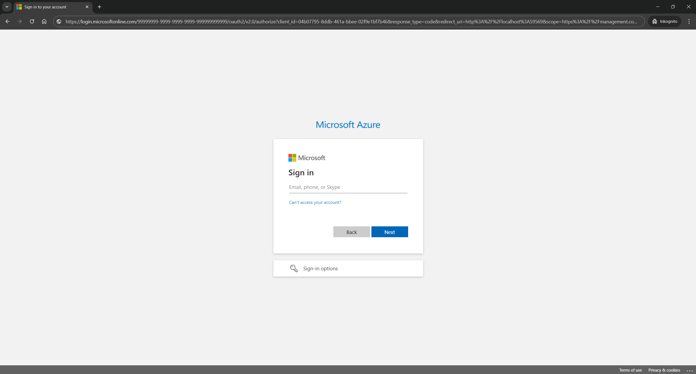

# Create and assign recording policy

In this step we will create a recording policy and assign the recording policy to all users of our
Microsoft Entra ID tenant.

## Create recording policy

Let us start with creating a recording policy.

### Install Powershell module

Before we can start to create the policy, we have to install the Microsoft Teams powershell module.

> [!NOTE]  
> If you already have the powershell module installed please run `Update-Module MicrosoftTeams`,
> load the modulue and continue with [log in to the powershell module](#log-in-to-teams-powershell-module)

To do install the module we first have to set a new powershell execution policy in an evelated
(Run as Admin) powershell terminal:

```powershell
Set-PsExecutionPolicy RemoteSigned
```

The command should not output anything to the console and we can continue with installing the
Microsoft Teams powershell moduel:

```powershell
Install-Module MicrosoftTeams
```

The output of the command asks us if we want to install the powershell module from an untrusted repository:

```text
Untrusted repository
You are installing the modules from an untrusted repository. If you trust this repository, change its
InstallationPolicy value by running the Set-PSRepository cmdlet. Are you sure you want to install the modules from
'PSGallery'?
[Y] Yes  [A] Yes to All  [N] No  [L] No to All  [S] Suspend  [?] Help (default is "N"):
```

Which we will accept with `y`. After that we should see a loading bar and the installation should
finish successful with no further output. Then we can load the module:

```powershell
Import-Module MicrosoftTeams
```

Which again should not print anything to our terminal.

### Log in to Teams powershell module

To do the Teams powershell module we run:

```powershell
Connect-MicrosoftTeams
```

The command should open our default browser and show a page similar to:



On the Microsoft Login Page we log in with our Microsoft Entra ID administrator account and accept
requested scopes.

The output in the terminal after we successfully logged in and accepted scopes should look similar to:

```text

Account              Environment Tenant                               TenantId
-------              ----------- ------                               --------
user@xyz.com         AzureCloud  99999999-9999-9999-9999-999999999999 99999999-9999-9999-9999-999999999999

```

### Create an Application Instance

Now we can create an Application Instance that is linked to our App Registration:

```powershell
New-CsOnlineApplicationInstance
   -UserPrincipalName tutorialbot@lm-ag.de
   -DisplayName "Tutorial Bot"
   -ApplicationId cccccccc-cccc-cccc-cccc-cccccccccccc
```

The output of that should be similar to:

```text
ApplicationId                        DisplayName  ObjectId                             PhoneNumber TenantId UserPrincipalName
-------------                        -----------  --------                             ----------- -------- -----------------
cccccccc-cccc-cccc-cccc-cccccccccccc Tutorial Bot 11111111-1111-1111-1111-111111111111                      tutorialbot@lm-ag.de
```

We copy the _ObjectId_ from the output(in the example output it is
`11111111-1111-1111-1111-111111111111`) and save it for later.

After that we sync the Application Instance into the remote service:

```powershell
Sync-CsOnlineApplicationInstance
    -ObjectId 11111111-1111-1111-1111-111111111111
    -ApplicationId cccccccc-cccc-cccc-cccc-cccccccccccc
```

When the command ran successful we should not see any additional output in our terminal.

### Create a Recording Policy

After creating the Application Instance we can continue with creating a Recording Policy:

```powershell
New-CsTeamsComplianceRecordingPolicy
   -Identity "TutorialPolicy"
   -Enabled $true
```

The creation of a policy should not print anything to our terminal.

### Create a Recording Application

In the next step we need to link the Application Instance and the Recording Policy, to do so we
create a Recording Application:

```powershell
New-CsTeamsComplianceRecordingApplication
   -Parent "TutorialPolicy"
   -Id 11111111-1111-1111-1111-111111111111
```

If the command executed successfully, we should see no output in our terminal window.

## Assign recording policy to users in tenant

Now that we have created a policy, we can assign the policy to all users in our tenant:

```powershell
Grant-CsTeamsComplianceRecordingPolicy 
      -Global 
      -PolicyName "TutorialPolicy"
```

Similar to the previous commands this one also does not print anything to our terminal.

In the next and final step we will check if the sample works and
[validate if we can see a recording notification in teams](./7-test.md).
