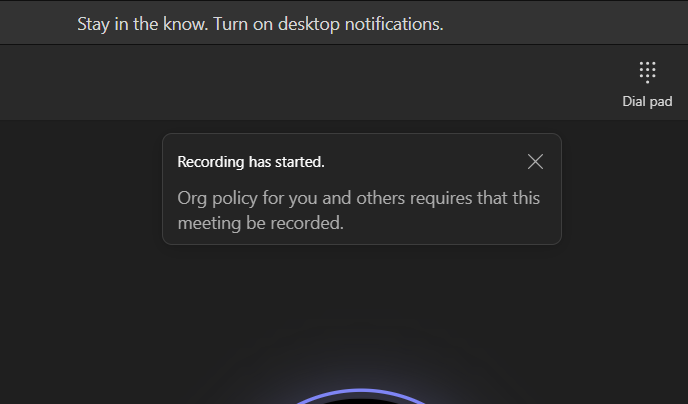

# Verify functionality

In order for us to verify the functionality, we need two Teams users in our tenant. Either ask a
colleague to log in to their Teams client or use a browser profile with [Microsoft Teams](https://teams.cloud.microsoft)
for each Teams user.

## Setup Test Call

After both user accounts are freshly logged in to their Teams client, we can directly call one Teams
user with the other client.

## Verify Recording Banner

After we successfully set up a test call we should see the a banner in both of our Teams clients:

Congratulations, we deployed and successfully configured a Compliance Recording Bot, in the next
steps we can customize the Recording Bot Application to meet our custom use-cases.
