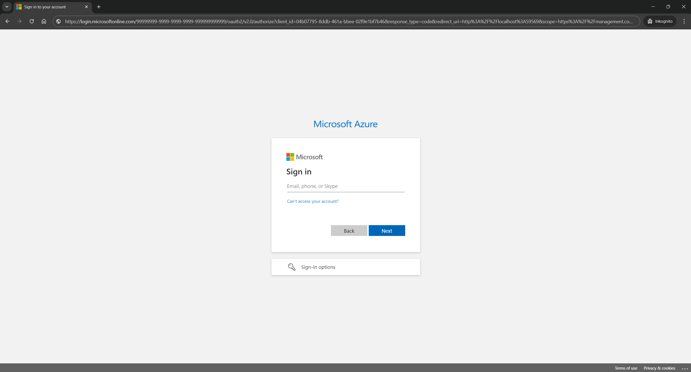

# Deploy an AKS cluster

We'll start with deploying an AKS cluster, on the AKS cluster we later deploy the containers with the sample recording bot. Before we can start to run commands in the Azure command line tool, we have to login, to do so, we run:

```powershell
az login --tenant 99999999-9999-9999-9999-999999999999
```

After running the command, it should show the following message:

```text
The default web browser has been opened at https://login.microsoftonline.com/99999999-9999-9999-9999-999999999999/oauth2/v2.0/authorize. Please continue the login in the web browser. If no web browser is available or if the web browser fails to open, use device code flow with `az login --use-device-code`.
```

And a Browser window with the Microsoft Login Page should open.



There we login with our Microsoft Entra Id administrator account and accept the scopes requested.

After successful log in, we should see a output similar to:

```json
[
  {
    "cloudName": "AzureCloud",
    "homeTenantId": "99999999-9999-9999-9999-999999999999",
    "id": "yyyyyyyy-yyyy-yyyy-yyyy-yyyyyyyyyyyyy",
    "isDefault": true,
    "managedByTenants": [],
    "name": "recordingbotsubscription",
    "state": "Enabled",
    "tenantId": "99999999-9999-9999-9999-999999999999",
    "user": {
      "name": "user@xyz.com",
      "type": "user"
    }
  }
]
```

## Create Azure Resource Group

Now we can start to create resources in our azure subscription. We start with creating a resource group in our Azure Subscription.

```powershell
az group create 
    --location westeurope 
    --name recordingbottutorial 
    --subscription "recordingbotsubscription"
```

The result in the command line should look something like:

```json
{
  "id": "/subscriptions/yyyyyyyy-yyyy-yyyy-yyyy-yyyyyyyyyyyyy/resourceGroups/recordingbottutorial",
  "location": "westeurope",
  "managedBy": null,
  "name": "recordingbottutorial",
  "properties": {
    "provisioningState": "Succeeded"
  },
  "tags": null,
  "type": "Microsoft.Resources/resourceGroups"
}
```

## Create Azure Kubernetes Cluster

Now we can create an AKS cluster in the resource group, we will create a free tier cluster, this doesn't mean the nodes of the cluster are for free but the managment plane is. A free tier cluster is for testing and development and should not be used for production, see [pricing tiers](https://learn.microsoft.com/en-us/azure/aks/free-standard-pricing-tiers) for reference. And set the node count of the system nodepool, that is automatically created, to 1, because we want to avoid unnecessary cost from this tutorial. For the size of the system nodes in the system nodepool we choose the `standard_d2s_v3`-series, as this series is available at the most regions and some nodes in this series are available without requesting more quotas. Still you might need to check you're quotas, see [per vm quotas](https://learn.microsoft.com/en-us/azure/quotas/per-vm-quota-requests) for reference.

So the command we exectute to deploy our AKS cluster we run the command:

```powershell
az aks create
    --location westeurope
    --name recordingbotcluster
    --resource-group recordingbottutorial
    --tier free
    --node-count 1
    --node-vm-size standard_d2s_v3
    --network-plugin azure
    --no-ssh-key  
    --yes
    --subscription "recordingbotsubscription"
```

After waiting for the command to complete the output in our powershell should look similar to:

```json
Resource provider 'Microsoft.ContainerService' used by this operation is not registered. We are registering for you.

{
  "aadProfile": null,
  "addonProfiles": null,
  "agentPoolProfiles": [
    {
      "availabilityZones": null,
      "capacityReservationGroupId": null,
      "count": 1,
      "creationData": null,
      "currentOrchestratorVersion": "1.28.5",
      "enableAutoScaling": false,
      "enableEncryptionAtHost": false,
      "enableFips": false,
      "enableNodePublicIp": false,
      "enableUltraSsd": false,
      "gpuInstanceProfile": null,
      "hostGroupId": null,
      "kubeletConfig": null,
      "kubeletDiskType": "OS",
      "linuxOsConfig": null,
      "maxCount": null,
      "maxPods": 30,
      "minCount": null,
      "mode": "System",
      "name": "nodepool1",
      "networkProfile": null,
      "nodeImageVersion": "AKSUbuntu-2204gen2containerd-202403.25.0",
      "nodeLabels": null,
      "nodePublicIpPrefixId": null,
      "nodeTaints": null,
      "orchestratorVersion": "1.28.5",
      "osDiskSizeGb": 128,
      "osDiskType": "Managed",
      "osSku": "Ubuntu",
      "osType": "Linux",
      "podSubnetId": null,
      "powerState": {
        "code": "Running"
      },
      "provisioningState": "Succeeded",
      "proximityPlacementGroupId": null,
      "scaleDownMode": null,
      "scaleSetEvictionPolicy": null,
      "scaleSetPriority": null,
      "spotMaxPrice": null,
      "tags": null,
      "type": "VirtualMachineScaleSets",
      "upgradeSettings": {
        "drainTimeoutInMinutes": null,
        "maxSurge": "10%",
        "nodeSoakDurationInMinutes": null
      },
      "vmSize": "standard_d2s_v3",
      "vnetSubnetId": null,
      "workloadRuntime": null
    }
  ],
  "apiServerAccessProfile": null,
  "autoScalerProfile": null,
  "autoUpgradeProfile": {
    "nodeOsUpgradeChannel": "NodeImage",
    "upgradeChannel": null
  },
  "azureMonitorProfile": null,
  "azurePortalFqdn": "recordingb-recordingbottuto-yyyyyy-1585fl53.portal.hcp.westeurope.azmk8s.io",
  "currentKubernetesVersion": "1.28.5",
  "disableLocalAccounts": false,
  "diskEncryptionSetId": null,
  "dnsPrefix": "recordingb-recordingbottuto-yyyyyy",
  "enablePodSecurityPolicy": null,
  "enableRbac": true,
  "extendedLocation": null,
  "fqdn": "recordingb-recordingbottuto-yyyyyy-1585fl53.hcp.westeurope.azmk8s.io",
  "fqdnSubdomain": null,
  "httpProxyConfig": null,
  "id": "/subscriptions/yyyyyyyy-yyyy-yyyy-yyyy-yyyyyyyyyyyyy/resourcegroups/recordingbottutorial/providers/Microsoft.ContainerService/managedClusters/recordingbotcluster",
  "identity": {
    "delegatedResources": null,
    "principalId": "51d916b6-0106-419f-825b-3d74e292559d",
    "tenantId": "99999999-9999-9999-9999-999999999999",
    "type": "SystemAssigned",
    "userAssignedIdentities": null
  },
  "identityProfile": {
    "kubeletidentity": {
      "clientId": "831201f7-171e-45d3-86a9-db8b87ded108",
      "objectId": "1aee7386-eb25-4ee0-91f8-cf4bf0641151",
      "resourceId": "/subscriptions/yyyyyyyy-yyyy-yyyy-yyyy-yyyyyyyyyyyyy/resourcegroups/MC_recordingbottutorial_recordingbotcluster_westeurope/providers/Microsoft.ManagedIdentity/userAssignedIdentities/recordingbotcluster-agentpool"
    }
  },
  "ingressProfile": null,
  "kubernetesVersion": "1.28",
  "linuxProfile": null,
  "location": "westeurope",
  "maxAgentPools": 100,
  "name": "recordingbotcluster",
  "networkProfile": {
    "dnsServiceIp": "10.0.0.10",
    "ipFamilies": [
      "IPv4"
    ],
    "loadBalancerProfile": {
      "allocatedOutboundPorts": null,
      "backendPoolType": "nodeIPConfiguration",
      "effectiveOutboundIPs": [
        {
          "id": "/subscriptions/yyyyyyyy-yyyy-yyyy-yyyy-yyyyyyyyyyyyy/resourceGroups/MC_recordingbottutorial_recordingbotcluster_westeurope/providers/Microsoft.Network/publicIPAddresses/cab190bb-ec74-478e-b7f1-b36c83bfa94e",
          "resourceGroup": "MC_recordingbottutorial_recordingbotcluster_westeurope"
        }
      ],
      "enableMultipleStandardLoadBalancers": null,
      "idleTimeoutInMinutes": null,
      "managedOutboundIPs": {
        "count": 1,
        "countIpv6": null
      },
      "outboundIPs": null,
      "outboundIpPrefixes": null
    },
    "loadBalancerSku": "standard",
    "natGatewayProfile": null,
    "networkDataplane": "azure",
    "networkMode": null,
    "networkPlugin": "azure",
    "networkPluginMode": null,
    "networkPolicy": null,
    "outboundType": "loadBalancer",
    "podCidr": null,
    "podCidrs": null,
    "serviceCidr": "10.0.0.0/16",
    "serviceCidrs": [
      "10.0.0.0/16"
    ]
  },
  "nodeResourceGroup": "MC_recordingbottutorial_recordingbotcluster_westeurope",
  "oidcIssuerProfile": {
    "enabled": false,
    "issuerUrl": null
  },
  "podIdentityProfile": null,
  "powerState": {
    "code": "Running"
  },
  "privateFqdn": null,
  "privateLinkResources": null,
  "provisioningState": "Succeeded",
  "publicNetworkAccess": null,
  "resourceGroup": "recordingbottutorial",
  "resourceUid": "0123456789abcdef12345678",
  "securityProfile": {
    "azureKeyVaultKms": null,
    "defender": null,
    "imageCleaner": null,
    "workloadIdentity": null
  },
  "serviceMeshProfile": null,
  "servicePrincipalProfile": {
    "clientId": "msi",
    "secret": null
  },
  "sku": {
    "name": "Base",
    "tier": "Free"
  },
  "storageProfile": {
    "blobCsiDriver": null,
    "diskCsiDriver": {
      "enabled": true
    },
    "fileCsiDriver": {
      "enabled": true
    },
    "snapshotController": {
      "enabled": true
    }
  },
  "supportPlan": "KubernetesOfficial",
  "systemData": null,
  "tags": null,
  "type": "Microsoft.ContainerService/ManagedClusters",
  "upgradeSettings": null,
  "windowsProfile": {
    "adminPassword": null,
    "adminUsername": "azureuser",
    "enableCsiProxy": true,
    "gmsaProfile": null,
    "licenseType": null
  },
  "workloadAutoScalerProfile": {
    "keda": null,
    "verticalPodAutoscaler": null
  }
}
```

> [!NOTE]  
> As we can see in the result json we created with the creation of the AKS cluster some more resources, e.g. a virtual machine scale set, a public IP and more. These resources are in a newly created resource group, in our case this resource group is called `MC_recordingbottutorial_recordingbotcluster_westeurope`. Search in the json how this resource group is called in your case, it should be in a similar pattern and write down this name as we need it later, to write it down now will save you some time later.

If the command fails with the message:

```text
unrecognized arguments: --tier free
```

the az Azure command line tool is out of date.

## Add Windows Node Pool

So now we have an AKS cluster with a linux node up and running, but the recording application needs windows nodes. So we have to add a windows nodepool to our aks cluster. We will create two nodes of the `standard_d2s_v3`-series. To do so we have to run the following command.

```powershell
az aks nodepool add
    --cluster-name recordingbotcluster
    --name win22
    --resource-group recordingbottutorial
    --node-vm-size standard_d2s_v3
    --node-count 2
    --os-type Windows
    --os-sku Windows2022 
    --subscription "recordingbotsubscription"
```

This command also needs some time to complete, our result output should look similar to:

```json
{
  "availabilityZones": null,
  "capacityReservationGroupId": null,
  "count": 2,
  "creationData": null,
  "currentOrchestratorVersion": "1.28.5",
  "enableAutoScaling": false,
  "enableEncryptionAtHost": false,
  "enableFips": false,
  "enableNodePublicIp": false,
  "enableUltraSsd": false,
  "gpuInstanceProfile": null,
  "hostGroupId": null,
  "id": "/subscriptions/yyyyyyyy-yyyy-yyyy-yyyy-yyyyyyyyyyyyy/resourcegroups/recordingbottutorial/providers/Microsoft.ContainerService/managedClusters/recordingbotcluster/agentPools/win22",
  "kubeletConfig": null,
  "kubeletDiskType": "OS",
  "linuxOsConfig": null,
  "maxCount": null,
  "maxPods": 30,
  "minCount": null,
  "mode": "User",
  "name": "win22",
  "networkProfile": null,
  "nodeImageVersion": "AKSWindows-2022-containerd-20348.2340.240401",
  "nodeLabels": null,
  "nodePublicIpPrefixId": null,
  "nodeTaints": null,
  "orchestratorVersion": "1.28.5",
  "osDiskSizeGb": 128,
  "osDiskType": "Managed",
  "osSku": "Windows2022",
  "osType": "Windows",
  "podSubnetId": null,
  "powerState": {
    "code": "Running"
  },
  "provisioningState": "Succeeded",
  "proximityPlacementGroupId": null,
  "resourceGroup": "recordingbottutorial",
  "scaleDownMode": "Delete",
  "scaleSetEvictionPolicy": null,
  "scaleSetPriority": null,
  "spotMaxPrice": null,
  "tags": null,
  "type": "Microsoft.ContainerService/managedClusters/agentPools",
  "typePropertiesType": "VirtualMachineScaleSets",
  "upgradeSettings": {
    "drainTimeoutInMinutes": null,
    "maxSurge": null,
    "nodeSoakDurationInMinutes": null
  },
  "vmSize": "standard_d2s_v3",
  "vnetSubnetId": null,
  "workloadRuntime": null
}
```

Very nice so far so now our AKS cluster has 1 linux system node and 2 windows nodes for our recording application.

## Untaint system nodepool

## Set DNS name

## Install kubectl tools

## Get AKS Credentials
