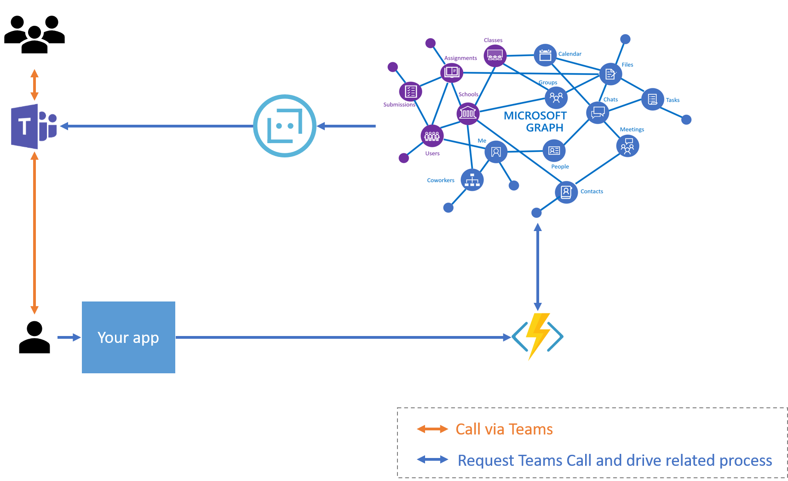

> **Note:**  
> Public Samples are provided by developers from the Microsoft Graph community.  
> Public Samples are not official Microsoft Communication samples, and not supported by the Microsoft Communication engineering team. It is recommended that you contact the sample owner before using code from Public Samples in production systems.

---
- Title: StartGroupCall 
- Description: This sample help you to learn how to start group call by submitting email addresses or existing online meeting id.
- author: [NT-D](https://github.com/NT-D)
---

# Introduction
[Microsoft Teams](https://products.office.com/en-us/microsoft-teams/group-chat-software) is popular collaboration tool. Users can chat, call and having online meeting with their colleagues.
Developers want to integrate their application with Teams. For example, their app triggers to start new group call with specific members. Thus users can collaborate well even if developers don't need to implement their own online meeting features and infrastructure.

## What you can see with this repo
A user can get group call from your app.


## Getting Started

This section walks you through the process of deploying and testing the sample bot. For easier understanding, please quick look at following architecture diagram. It will help you to understand relationship of each services/components.



### Bot Registration
1. Create your Microsoft 365 environment with [developer program](https://developer.microsoft.com/en-us/microsoft-365/dev-program).
1. Create 2 - 3 users in the Microsoft 365 environment.
1. Register app in you Azure AD and memo following information by referring [microsoft document](https://docs.microsoft.com/en-us/graph/auth-v2-service)
   - Client Id
   - Client Secret
   - Tenant Id
1. Setup the app permissions in Azure AD [(detailed permissions list)](./document/Permissions.md)


### Prerequisites
Install the prerequisities:
- [Visual Studio Code](https://code.visualstudio.com/)
- [ngrok](https://ngrok.com/)
- [Postman](https://www.postman.com/)
- Microsoft Teams mobile app in your phone and sign-in with your Microsoft 365 developer program account.

### Local Run
1. Clone repository and open with Visual Studio Code. If you get recommendation to install dependencies (extension and cli), please install them.
1. Copy `local.settings.sample.json` and paste as `local.settings.json` in same path.
1. Update `local.settings.json` with copied `Client Id` and `Client Secret` values.
1. Setup Azure Bot Service and enable Teams feature. [(document)](https://docs.microsoft.com/en-us/microsoftteams/platform/bots/calls-and-meetings/registering-calling-bot)
1. Setup [ngrok](https://ngrok.com/) for accepting webhook from Microsoft Graph. After you installed ngrok, please run it by `ngrok http 7071`. Then, you can see https forwarding url. Please copy the **https** url and paste it as value of `CallBackUrl` in `local.settings.json`.
1. Press [F5] key to run Azure Functions locally.

#### Start group call with specific email addresses
Please send following http request from Postman. You should insert email addresses which you created in the [Bot Registration] section in Microsoft 365.

HTTP POST http://localhost:7071/api/calls
BODY
```json
{
	"TenantId": "tenant id",
	"ParticipantEmails": [
		"email address",
        "email address"
	]
}
```

Sample BODY
```json
{
	"TenantId": "b21a0d16-4e90-4cdb-a05b-ad3846369881",
	"ParticipantEmails": [
		"masota@masotadev.onmicrosoft.com",
        "AdeleV@masotadev.onmicrosoft.com"
	]
}
```

#### Start group call with specific meeting id
1. Sign-in to Microsoft 365 and create new event in your calendar. This event should be online meeting and has 1 - 2 attendees.
1. Go to [Microsoft Graph Explorer](https://developer.microsoft.com/en-us/graph/graph-explorer) and replace `https://graph.microsoft.com/v1.0/me` to `https://graph.microsoft.com/v1.0/me/events`, then click [Run query] to see lists of your events in calendar. Please find event you created and copy id to your notepad/clipboard.
1. Send following http request from Postman.

HTTP POST http://localhost:7071/api/calls/{meeting id}

Body
```json
{
	"TenantId":"tenant id",
	"MeetingId":"meetin id which a user want to join",
	"UserEmail":  "user email who want to join call"
}
```

### Sample request
HTTP POST http://localhost:7071/api/calls/AAMkADViZGQxZWY4LWQ4YzUtNDRhOS04OTQyLWU1NWI5N2JkOWU0ZQBGAAAAAABlonO6N9eNRYv3Fm0mCU2XBwAMGKVZFv8rR4rhKgq_-6brAAAAAAENAAAMGKVZFv8rR4rhKgq_-6brAAAyaeaJAAA=

Body
```json
{
	"TenantId":"b21a0d16-4e90-4cdb-a05b-ad3846369881",
	"MeetingId":"AAMkADViZGQxZWY4LWQ4YzUtNDRhOS04OTQyLWU1NWI5N2JkOWU0ZQBGAAAAAABlonO6N9eNRYv3Fm0mCU2XBwAMGKVZFv8rR4rhKgq_-6brAAAAAAENAAAMGKVZFv8rR4rhKgq_-6brAAAyaeaJAAA=",
	"UserEmail":  "masota@masotadev.onmicrosoft.com"
}
```


### Test
In this section, we assume you've finished previous section to setup dev environment.
1. Open project with Visual Studio Code
1. Ctrl+Shift+P(windows)/Command+ShiftP(Mac) to show command pallet.
1. Select `Tasks:Run test tasks` to run test

You can see test results and coverage in the VS Code terminal. If you've installed [Coverage Gutters](https://marketplace.visualstudio.com/items?itemName=ryanluker.vscode-coverage-gutters) extension, you can see code covered inline by clicking [Watch] button.

# Appendix: lancuage, SDK and utilities information
## Programming language
- C# with .Net Core 3.1: Because we can utilize dependecy injection on Azure Functions and Azure SDKs, we picked up C# for this sample.

## Tools for back-end application
- [Azure Functions](https://azure.microsoft.com/en-us/services/functions/): Serverless platform to run your code. In this repository, we simply implement without database for keeping sample simple.

## Tools for Teams call
- [Microsoft Graph](https://developer.microsoft.com/en-us/graph/): You can utilize Micorosft Graph to utilize Microsoft 365 back-end. For example, you can fetch users' email, calendar.. etc. In this repository, we utilize it to integrate Microsoft Teams.
- [Azure Active Directory](https://azure.microsoft.com/en-us/services/active-directory/): This is identitiy platform. For utilizing Microsoft Graph, you need to utilize it for making secure connection between your app and Microsoft Graph (Microsoft Teams).
- [Azure Bot Service](https://azure.microsoft.com/en-us/services/bot-service/): Microsoft graph need bot to start Teams Call.

## Authorization flow
- [OAuth 2.0 client credential flow](https://docs.microsoft.com/en-us/azure/active-directory/develop/v2-oauth2-client-creds-grant-flow): Because our app is worker/deamon type service and can't have user interaction, we need to utilize client credential flow to fetch access token for Microsoft Graph.

## Consideration for productions
- For using App secret securely, you may want to use [Azure Key Vault](https://docs.microsoft.com/en-us/azure/key-vault/general/overview).
- For multi-tenant usage, you need to register your app as Multitenant application and let Aministrator in customer tenant grant app by [Admin consent flow](https://docs.microsoft.com/en-us/graph/auth-v2-service#3-get-administrator-consent).
