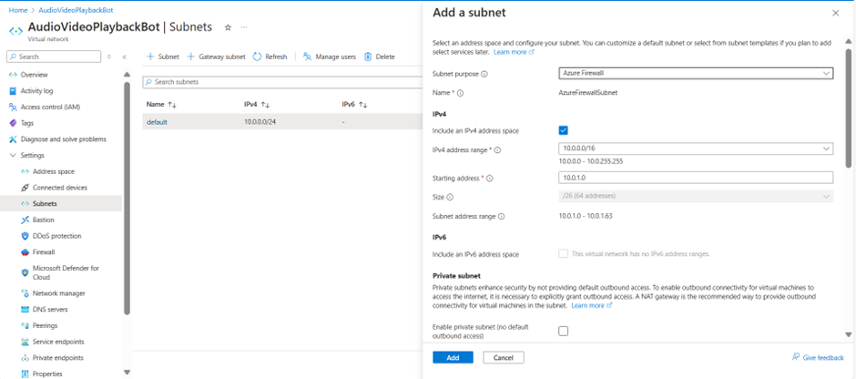
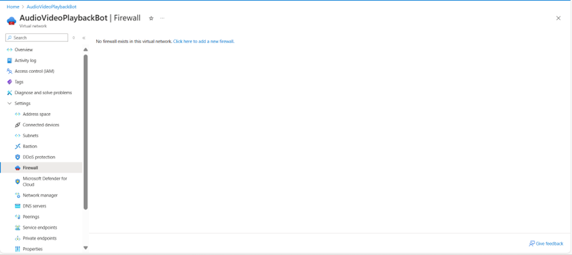
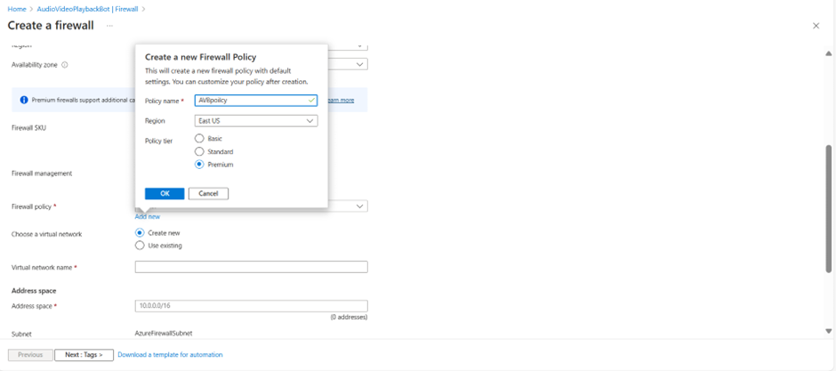

# Steps to Configure Azure Firewall
=====================================

## Step 1: Create a Virtual Network and Subnet for Azure Firewall

1. Go to Virtual Network or create a new one if it doesn't exist.
2. Create a subnet for the firewall with the purpose set to "Azure Firewall". 
3. Go to the firewall section and click on "Add firewall". 

## Step 2: Configure Firewall Settings

1. Choose a name for the firewall (e.g., "MyFirewall").
2. Create a new firewall policy. 
3. Select the existing Virtual Network.
4. Create a new public IP address (e.g., "MyFWPublicIP").
5. Review and create the firewall.

## Step 3: Configure Firewall Policy

1. Open the firewall policy created in Step 2.
2. Navigate to Settings.

### Configure Application Rules (Ingress)

1. Add an application rule:
    * Give a descriptive name.
    * Select "Application rule collection" as the rule type.
    * Assign the lowest number as the priority.
    * Specify a name for the rule.
    * Define the source (e.g., your VM subnet) or use `*` to allow all IP addresses.
    * Allow specific domains (e.g., `audiovideoplaybackbot.eastus.cloudapp.azure.com`).
    * Save the rule.

### Configure Network Rules (Egress)

1. Add a network rule:
    * Give a descriptive name.
    * Select "Network rule collection" as the rule type.
    * Assign the lowest number as the priority.
    * Specify a name for the rule.
    * Define the source (e.g., your VM subnet) or use `*` to allow all IP addresses.
    * Specific external IPs or ranges (e.g., 192.168.1.0/24 for a subnet) instead of using 0.0.0.0/0 for all. This ensures that only trusted sources can access your service. If you want to allow access from all IPs, you can configure it as 0.0.0.0/0.
    * Specify only particular protocols and ports you want to allow. For example, you may configure TCP ports like 9444, 8445, 9442, 443, and port ranges like 10100-10199 and 20100-20199. If you want to restrict access   to everything else, you should mention specific configurations like below:
     Allowed TCP ports: 9444, 8445, 9442, 443, 9441, 10100-10199, 20100-20199.
     All other ports and protocols will be restricted.
    * Save the rule.

### Firewall Configuration Summary

 * Specify External IPs or Ranges
    Allow only specific external IPs or ranges (e.g., 192.168.1.0/24 for a subnet) instead of using 0.0.0.0/0 for all. This ensures that only trusted sources can access your service. If you want to allow access from all IPs, you can configure it as 0.0.0.0/0.

   Example:
    To allow access from a specific subnet:
     Allow: 192.168.1.0/24

    To allow access from all IPs:
     Allow: 0.0.0.0/0

 * Specify Allowed Protocols and Ports
    You can specify only particular protocols and ports you want to allow. For example, configure the following:
    Allowed TCP Ports:
    9444 (SignalingPort)
    8445 (MediaPort)
    9442 (TcpForwardingPort)
    443 (DefaultEndpoint)
    9441 (localPort)
    10100-10199 (InstanceCallControlEndpoint)
    20100-20199 (InstanceMediaControlEndpoint)

    No UDP ports are allowed or needed.

    All other ports and protocols will be restricted.

   Example of Ingress Allow Rules:

    Allow TCP Port 9444:
    Rule Name: Allow SignalingPort
    Action: Allow
    Protocol: TCP
    Port: 9444

    Allow TCP Port 8445:
    Rule Name: Allow MediaPort
    Action: Allow
    Protocol: TCP
    Port: 8445

    Allow TCP Port 9442:
    Rule Name: Allow TcpForwardingPort
    Action: Allow
    Protocol: TCP
    Port: 9442

    Allow TCP Port 443:
    Rule Name: Allow DefaultEndpoint
    Action: Allow
    Protocol: TCP
    Port: 443

    Allow TCP Port 9441:
    Rule Name: Allow LocalPort
    Action: Allow
    Protocol: TCP
    Port: 9441

    Allow TCP Port Range 10100-10199:
    Rule Name: Allow InstanceCallControlEndpoint
    Action: Allow
    Protocol: TCP
    Port Range: 10100-10199

    Allow TCP Port Range 20100-20199:
    Rule Name: Allow InstanceMediaControlEndpoint
    Action: Allow
    Protocol: TCP
    Port Range: 20100-20199

 * Restrict All Other Ingress Ports and Protocols:
    After creating the allow rules, add a rule to deny all other traffic. This ensures that any port or protocol not explicitly allowed is blocked.

   Example of Deny Rule:
    Deny All Other Ingress Traffic:
    Rule Name: Deny All Other Ingress Traffic
    Action: Deny
    Protocol: Any
    Port: Any

   Example of Egress Allow Rules
    Allow TCP Port 9444:
    Rule Name: Allow Egress SignalingPort
    Action: Allow
    Protocol: TCP
    Port: 9444

    Allow TCP Port 8445:
    Rule Name: Allow Egress MediaPort
    Action: Allow
    Protocol: TCP
    Port: 8445

    Allow TCP Port 9442:
    Rule Name: Allow Egress TcpForwardingPort
    Action: Allow
    Protocol: TCP
    Port: 9442

    Allow TCP Port 443:
    Rule Name: Allow Egress DefaultEndpoint
    Action: Allow
    Protocol: TCP
    Port: 443

    Allow TCP Port 9441:
    Rule Name: Allow Egress LocalPort
    Action: Allow
    Protocol: TCP
    Port: 9441

    Allow TCP Port Range 10100-10199:
    Rule Name: Allow Egress InstanceCallControlEndpoint
    Action: Allow
    Protocol: TCP
    Port Range: 10100-10199

    Allow TCP Port Range 20100-20199:
    Rule Name: Allow Egress InstanceMediaControlEndpoint
    Action: Allow
    Protocol: TCP
    Port Range: 20100-20199

* Restrict All Other Egress Ports and Protocols
    Similarly, add a rule to deny all other egress traffic.
    
   Example of Deny Rule: 
    Deny All Other Egress Traffic:
    Rule Name: Deny All Other Egress Traffic
    Action: Deny
    Protocol: Any
    Port: Any
    