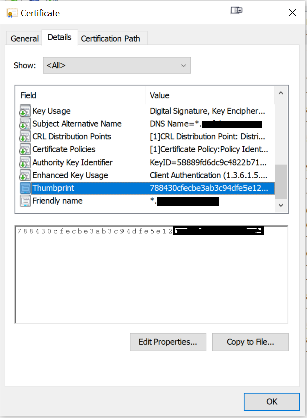
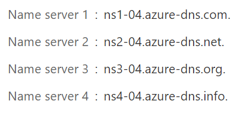
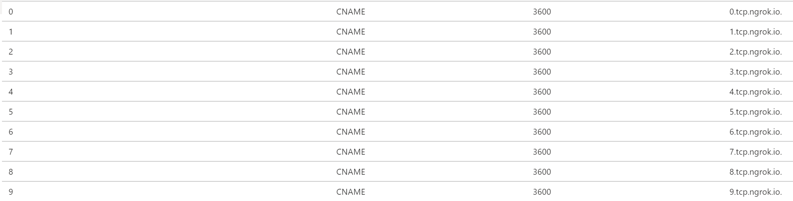

# Introduction

## About

The AudioVideoPlaybackBot sample guides you through building, deploying and testing an application hosted media bot. This sample demonstrates how a bot can do a video stream and change screen sharing role.

## Getting Started

This section walks you through the process of deploying and testing the sample bot.

### Bot Registration

1. Follow the steps in [Register Calling Bot](https://microsoftgraph.github.io/microsoft-graph-comms-samples/docs/articles/calls/register-calling-bot.html). Save the bot name, bot app id and bot secret for configuration.

2. Add the following Application Permissions to the bot:

    * Calls.AccessMedia.All
    * Calls.Initiate.All
    * Calls.JoinGroupCall.All
    * Calls.JoinGroupCallAsGuest.All

3. The permission needs to be consented by tenant admin. Go to `https://login.microsoftonline.com/common/adminconsent?client_id=<app_id>&state=<any_number>&redirect_uri=<any_callback_url>` using tenant admin to sign-in, then consent for the whole tenant.

### Prerequisites

* Install the prerequisites:
  * [Visual Studio 2017+](https://visualstudio.microsoft.com/downloads/)
  * [PostMan](https://www.postman.com/downloads/)
  * [Microsoft Visual C++ Redistributable for Visual Studio 2015, 2017 and 2019](https://support.microsoft.com/en-us/help/2977003/the-latest-supported-visual-c-downloads) - download and install x64 version when you need to run this sample from your local PC.

## Deploy

### Cloud [Azure] deployment

1. Create a cloud service (classic) in Azure. Get your "Site URL" from Azure portal, this will be your DNS name and CN name for later configuration, for example: `bot.contoso.com`.

2. Set up SSL certificate and upload to the cloud service
    1. Create a wildcard certificate for your service. This certificate should not be a self-signed certificate. For instance, if your bot is hosted at `bot.contoso.com`, create the certificate for `*.contoso.com`.
    2. Upload the certificate to the cloud service.
    3. Copy the thumbprint for later.

3. Set up cloud service configuration
    1. Open powershell, go to the folder that contains file `configure_cloud.ps1`. The file is in the `Samples` directory.
    2. Run the powershell script with parameters:

        `.\configure_cloud.ps1 -p {path to project} -dns {your DNS name} -cn {your CN name, should be the same as your DNS name} -thumb {your certificate thumbprint} -bid {your bot name} -aid {your bot app id} -as {your bot secret}`

        For example:

        `.\configure_cloud.ps1 -p .\V1.0Samples\LocalMediaSamples\AudioVideoPlaybackBot\ -dns bot.contoso.com -cn bot.contoso.com -thumb ABC0000000000000000000000000000000000CBA -bid bot -aid 3853f935-2c6f-43d7-859d-6e8f83b519ae -as 123456!@#$%^`

4. Publish AudioVideoPlaybackBot from VS:
    1. Right click AudioVideoPlaybackBot, then click Publish.... Publish it to the cloud service you created earlier.

### Local Deployment

In this section we explain how to configure a local PC (Windows 10) and then run AudioVideoPlaybackBot directly from the local environment.
AudioVideoPlaybackBot uses HTTP to listen and respond to HTTP REST API requests, but for incoming calls and online meeting communication this bot uses the lower-level TCP. We will be using `Ngrok` which supports TCP tunnels in addition to HTTP tunnels.
Below you'll learn how to configure ngrok in order to create a tunnel between your local computer and the internet.

### Configure NGROK

1. Go to [Ngrok](https://ngrok.com/) and sign up for a free account or log into your existing account. Once you've logged in, go to the dashboard and get your authtoken.

    >Note: A free Ngrok account, while it is good for a quick demos and once-in-while use of the media bots, for a more stable no-code change experience we recommend to purchase a Ngrok Pro account, which allows to use reserved domains and TCP addresses. Later you will see how these two settings can come handy having them fixed, pre-reserved in your Ngrok account.

2. If you have purchased a Ngrok Pro account (see the Note above), then make sure you have at least one reserved domain (e.g. `contoso.ngrok.io`), and at least one reserved TCP address (e.g. `1.tcp.ngrok.io:12332`). Write them down in your notes.
Alternatively, if you're using a free Ngrok account, you'd be required to write down the Ngrok domain and TCP address from the Ngrok console each time you restart Ngrok command on your PC.

3. Create an ngrok configuration file `ngrok.yml` (see [here](https://ngrok.com/docs#config) for more information on where this file can be located) and add this line on top of the file:

```json
authtoken: <Your-AuthToken>
```

4.As with the bot's messaging API, in order for the Real-time Media Platform to talk to your bot, your bot must be reachable over the internet. Ngrok makes this simple — add the following lines to your ngrok.yml:

Ngrok Free Version:

```json
tunnels:
  signaling:
    addr: "https://localhost:9441"
    proto: http
    host-header: localhost
```

Ngrok Pro Version:

```json
tunnels:
  signaling:
    addr: "https://localhost:9441"
    proto: http
    subdomain: <Your-Ngrok-Domain>
    host-header: localhost
```

5.Now, setup a TCP tunnel to forward the traffic to localhost. Write the following lines into your ngrok.yml:

Ngrok Free Account

```json
  media:
    addr: 8445
    proto: tcp
```

Ngrok Pro Account

```json
  media:
    addr: 8445
    proto: tcp
    remote_addr: <Your-Ngrok-TCP-Address>
```

6.Your ngrok.yml now should look something like this:

Ngrok Free Version

```json
authtoken: 43ksdfjlsielsdf_siwoeirwXXXX
tunnels:
  signaling:
    addr: "https://localhost:9441"
    proto: http
    host-header: localhost
  media:
    addr: 8445
    proto: tcp
```

Ngrok Pro Version

```json
authtoken: 43ksdfjlsielsdf_siwoeirwXXXX
tunnels:
  signaling:
    addr: "https://localhost:9441"
    proto: http
    subdomain: contoso
    host-header: localhost
  media:
    addr: 8445
    proto: tcp
    remote_addr: "1.tcp.ngrok.io:12332"
```

7.Now that the ngrok configuration is ready, launch it:

`ngrok.exe start -all -config <Path to your ngrok.yml>`

This starts ngrok and defines the public URLs which provide the tunnels to your localhost. The output looks like the following:

Ngrok Free Account

```cmd
Forwarding  tcp://0.tcp.ngrok.io:15448 -> localhost:8445
Forwarding  http://32f6055e17b3.ngrok.io -> https://localhost:9441
Forwarding  https://32f6055e17b3.ngrok.io -> https://localhost:9441
```

Here, 9441 is the signaling port, 8445 is the application-hosted port, 32f6055e17b3 is a randomly generated ngrok domain name (note that it will change every time you restart ngrok), 0.tcp.ngrok.io:15448 is a randomly generated remote TCP address (note that it will change every time you restart ngrok).

Ngrok Pro Account

```cmd
Forwarding  tcp://1.tcp.ngrok.io:12332 -> localhost:8445
Forwarding  http://contoso.ngrok.io -> localhost:9441
Forwarding  https://contoso.ngrok.io -> localhost:9441
```

Here, 9441 is the signaling port, 8445 is the application-hosted port, and 12332 is the remote media port exposed by ngrok. Of course, these port numbers are just examples and you can use any available port.

#### Setting up domain and SSL certificates

>Note: This section is only required for application-hosted media bots and can be skipped if you don't host media yourself.

Application-hosted media uses certificates and TCP tunnels. The following steps are required:

1. Create and register a domain name with one of the popular domain registrars. For our example here, we'll refer to it as: `contoso.com`

2. A SSL certificate is required for your domain's based URLs. To make it easy, use a SSL certificate issued to a wildcard domain. In this case, it would be `*.contoso.com`. This SSL certificate is validated by the media SDK, so it should match your bot's public URL.

3. After installing the SSL certificate in your PC's local machine certificates store, open the certificate's details and take a note of the thumbprint as you will use it later.


>Note: Thumbprint is a property that is  attached to the certificate object by CryptoAPI subsystem and this value is always hashed with SHA1 (160 bit) algorithm. Its value is typically rendered as a hexadecimal number, 40 digits long and should never include any whitespaces, colons or uppercases letters.

#### Configuring DNS Zone

Ngrok's public TCP endpoints have fixed URLs. They are 0.tcp.ngrok.io, 1.tcp.ngrok.io, and so on. You should have a DNS CNAME entry for your service that points to these URLs. In this example, let's say 0.contoso.com refers to 0.tcp.ngrok.io, 1.contoso.com refers to 1.tcp.ngrok.io, and so on.
You have two options to add CNAME records to your domain:

1. Go to your domain registrar website and follow their instructions to create and add CNAME records in the DNS for your domain.
2. Create and configure DNS Zone in Azure.

Here, we will show how to achieve the latter, following these steps:

1. Go to and log into your Azure subscription account at portal.azure.com

2. Follow these [instructions](https://docs.microsoft.com/en-us/azure/dns/dns-getstarted-portal) to create amd configure Azure DNS.

3. Note the Name servers for your Azure DNS Zone, which you can find at the top right corner of your Azure DNS zone dashboard:


4. Go to your domain registrar, and change/add the default Name servers with the Name servers you've copied from your Azure DNS Zone dashboard.
    >Note: It may take up to 48 hours depending on your registrar policy to replicate the Name servers change.

5. Now, continue editing your Azure DNS zone settings by adding 10 new CNAME records. Click on `+ Record set` menu button to open a window for adding a new record set.

6. In the `Name` text field, enter `0`, so it constructs the full 0.contoso.com record.

7. In the `Type` dropbox choose `CNAME` as the record type.

8. In the `Alias` text field enter `0.tcp.ngrok.io.`. Then click `OK` button to save a new CNAME record.

9. Repeat steps 5-8 nine more times to create the CNAME records for 0-9.tcp.ngrok.io addresses.

10. At the end, you should have 10 new record sets look like this:


#### Configure local environment

After you have configured your domain, ngrok and install SSL certificate on your PC, it's time to configure local environment and re-build the solution. Follow these steps:

1. Substitute the template values in [cert_setup.cmd](../cert_setup.cmd):
`%YOUR-SSL-CERTIFICATE-THUMBPRINT%` with your SSL Certificate Thumbprint, and
`%GUID from AssemblyInfo.cs of your project%` with the corresponding GUID obtained from `AssemblyInfo.cs`.

2. Open PowerShell or Command Console Window in Administrative mode.

3. Execute `cert_setup.cmd` from the command line.

4. Go to the root folder of your solution's file structure and find the PowerShell script [configure_cloud.ps1](../../../configure_cloud.ps1). Open the PowerShell console and execute this line:
```PowerShell
.\configure_cloud.ps1 -p .\V1.0Samples\LocalMediaSamples\AudioVideoPlaybackBot\ -dns 1.contoso.com -cn contoso.ngrok.io -thumb <YOUR CERTIFICATE THUMBPRINT> -bid <YOUR BOT NAME> -aid <YOUR BOT APP ID> -as <YOUR BOT APP SECRET> -sp 9441 -mp 8445 -tcp 12332
```

where:
- 1.contoso.com: is constructed from the following two parts:
  - 1: the subdomain number you find in the ngrok TCP Forwarding URL. E.g. tcp://1.tcp.ngrok.io:12332
  - contoso.com: is your domain name for which you've created the CNAME record in your Azure DNS zone that redirects to (0-9).tcp.ngrok.io addresses
- contoso.ngrok.io: is the combination of your domain name and ngrok.io. For ngrok free accounts, this will be represented with a randomly generated subdomain name, which will change every time you restart ngrok.exe
- 9441: is the signaling port
- 8445: is the application-hosted port
- 12332: is the remote media port exposed by ngrok

5.Rebuild Visual Studio solution

#### Run AudioVideoPlaybackBot locally

Now, that you have configured all local environment settings and your Visual Studio solution is rebuilt, your bot can now run locally and all the flows work from your localhost.

Once ngrok is up and running, start your solution from Visual Studio, which loads it in the Azure Cloud Service emulator. Note any exception messages in the Output window. If the Media Platform instantiates successfully, you're ready to move to the next step. Testing.

### Test

>Note: The Teams meeting should be scheduled in the same Teams tenant as the one was used to grant the AVPlaybackBot bot access permissions.

1. Schedule a Teams meeting with another person.

    

2. Copy the Join Microsoft Teams Meeting link. Depending on where you copy this, this may be encoded as a safe link in Outlook.

    

    Example, `https://teams.microsoft.com/l/meetup-join/19:cd9ce3da56624fe69c9d7cd026f9126d@thread.skype/1509579179399?context={"Tid":"72f988bf-xxxx-xxxx-xxxx-xxxxxxxxxxxx","Oid":"550fae72-xxxx-xxxx-xxxx-xxxxxxxxxxxx","MessageId":"1536978844957"}`

4. Invite your Bot to join the meeting by interacting with it thru the Postman HTTP REST API service calls, _adjusting the service URL appropriately_.
    1. Use Postman to post the following `JSON` payload.

        ##### Request

        ```http
        POST https://bot.contoso.com/joinCall
        Content-Type: application/json
        {
            "JoinURL": "https://teams.microsoft.com/l/meetup-join/...",
        }
        ```

        ##### Response

        The guid "491f0500-401f-4f11-8af4-2eff4c0a0643" in the response will be your call id. Use your call id for the next request.

        ```json
        {
            "legId": "491f0500-401f-4f11-8af4-2eff4c0a0643",
            "scenarioId": "98ca8eab-8c03-4b7d-a468-15b37c0b648e",
            "call": "https://bot.contoso.com:10100/calls/491f0500-401f-4f11-8af4-2eff4c0a0643",
            "logs": "https://bot.contoso.com:10100/logs/491f0500-401f-4f11-8af4-2eff4c0a0643",
            "changeScreenSharingRole": "https://bot.contoso.com:10100/calls/491f0500-401f-4f11-8af4-2eff4c0a0643/changeRole"
        }
        ```

    2. After the bot joins the meeting the bot will start playing a video. Change the bot's screen sharing role by `POST` changeRole request. Replace the call id 491f0500-401f-4f11-8af4-2eff4c0a0643 below with your call id from the first response.

        ##### Request
        ```http
        POST https://bot.contoso.com/calls/491f0500-401f-4f11-8af4-2eff4c0a0643/changeRole
        Content-Type: application/json
        {
            "role": "viewer"
        }
        ```

        You can play around with the bot by switching the screensharing role from "viewer" to "sharer" or from "sharer" to "viewer"

    3. Get diagnostics data from the bot. Open the links in a browser for auto-refresh. Replace the call id 491f0500-401f-4f11-8af4-2eff4c0a0643 below with your call id from the first response.
       * Active calls: https://bot.contoso.com/calls
       * Service logs: https://bot.contoso.com/logs

    4. Terminating the call through `DELETE`. Replace the call id 491f0500-401f-4f11-8af4-2eff4c0a0643 below with your call id from the first response.

        ##### Request

        ```http
        DELETE https://bot.contoso.com/calls/491f0500-401f-4f11-8af4-2eff4c0a0643
        ```
