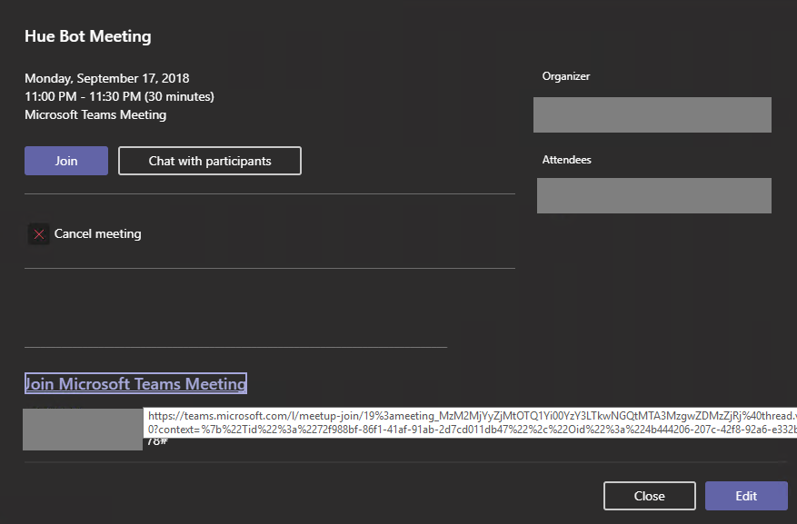

# Introduction

## About

The AudioVideoPlaybackBot sample guides you through building, deploying and testing an application hosted media bot. This sample demonstrates how a bot can do a video stream and change screen sharing role.

## Getting Started

This section walks you through the process of deploying and testing the sample bot.

### Bot Registration

1. Follow the steps in [Register Calling Bot](https://microsoftgraph.github.io/microsoft-graph-comms-samples/docs/articles/calls/register-calling-bot.html). Save the bot name, bot app id and bot secret for configuration.

1. Add the following Application Permissions to the bot:

    * Calls.AccessMedia.All
    * Calls.Initiate.All
    * Calls.JoinGroupCall.All
    * Calls.JoinGroupCallAsGuest.All
   
1. The permission needs to be consented by tenant admin. Go to "https://login.microsoftonline.com/common/adminconsent?client_id=<app_id>&state=<any_number>&redirect_uri=<any_callback_url>" using tenant admin to sign-in, then consent for the whole tenant.

### Prerequisites

* Install the prerequisites:
    * [Visual Studio 2017+](https://visualstudio.microsoft.com/downloads/)
    * [PostMan](https://chrome.google.com/webstore/detail/postman/fhbjgbiflinjbdggehcddcbncdddomop)

### Deploy

#### [Azure] deployment

1. Create a cloud service (classic) in Azure. Get your "Site URL" from Azure portal, this will be your DNS name and CN name for later configuration, for example: `bot.contoso.com`.

1. Set up SSL certificate and upload to the cloud service
    1. Create a wildcard certificate for your service. This certificate should not be a self-signed certificate. For instance, if your bot is hosted at `bot.contoso.com`, create the certificate for `*.contoso.com`.
    2. Upload the certificate to the cloud service.
    3. Copy the thumbprint for later.

1. Set up cloud service configuration
    1. Open powershell, go to the folder that contains file `configure_cloud.ps1`. The file is in the `Samples` directory.
    2. Run the powershell script with parameters 

        `.\configure_cloud.ps1 -p {path to project} -dns {your DNS name} -cn {your CN name, should be the same as your DNS name} -thumb {your certificate thumbprint} -bid {your bot name} -aid {your bot app id} -as {your bot secret}`

        For example:

        `.\configure_cloud.ps1 -p .\V1.0Samples\LocalMediaSamples\AudioVideoPlaybackBot\ -dns bot.contoso.com -cn bot.contoso.com -thumb ABC0000000000000000000000000000000000CBA -bid bot -aid 3853f935-2c6f-43d7-859d-6e8f83b519ae -as 123456!@#$%^`

1. Publish AudioVideoPlaybackBot from VS:
    1. Right click AudioVideoPlaybackBot, then click Publish.... Publish it to the cloud service you created earlier.

### Test

1. Schedule a Teams meeting with another person.

    

1. Copy the Join Microsoft Teams Meeting link. Depending on where you copy this, this may be encoded as a safe link in Outlook.

    

    Example, `https://teams.microsoft.com/l/meetup-join/19:cd9ce3da56624fe69c9d7cd026f9126d@thread.skype/1509579179399?context={"Tid":"72f988bf-xxxx-xxxx-xxxx-xxxxxxxxxxxx","Oid":"550fae72-xxxx-xxxx-xxxx-xxxxxxxxxxxx","MessageId":"1536978844957"}`

1. Join the meeting from the Teams client.

1. Interact with your service, _adjusting the service URL appropriately_.
    1. Use Postman to post the following `JSON` payload.

        ##### Request
        ```http
        POST https://bot.contoso.com/joinCall
        Content-Type: application/json
        {
            "JoinURL": "https://teams.microsoft.com/l/meetup-join/...",
        }
        ```

        ##### Response
        The guid "491f0500-401f-4f11-8af4-2eff4c0a0643" in the response will be your call id. Use your call id for the next request.
        ```json
        {
            "legId": "491f0500-401f-4f11-8af4-2eff4c0a0643",
            "scenarioId": "98ca8eab-8c03-4b7d-a468-15b37c0b648e",
            "call": "https://bot.contoso.com:10100/calls/491f0500-401f-4f11-8af4-2eff4c0a0643",
            "logs": "https://bot.contoso.com:10100/logs/491f0500-401f-4f11-8af4-2eff4c0a0643",
            "changeScreenSharingRole": "https://bot.contoso.com:10100/calls/491f0500-401f-4f11-8af4-2eff4c0a0643/changeRole"
        }
        ```

    1. After the bot joins the meeting. The bot will start playing a video. Change the bot's screen sharing role by `POST` changeRole request. Replace the call id 491f0500-401f-4f11-8af4-2eff4c0a0643 below with your call id from the first response.

        ##### Request
        ```http
        POST https://bot.contoso.com/calls/491f0500-401f-4f11-8af4-2eff4c0a0643/changeRole
        Content-Type: application/json
        {
            "role": "viewer"
        }
        ```
        You can play around with the bot by switching the screensharing role from "viewer" to "sharer" or from "sharer" to "viewer"

    1. Get diagnostics data from the bot. Open the links in a browser for auto-refresh. Replace the call id 491f0500-401f-4f11-8af4-2eff4c0a0643 below with your call id from the first response.
       * Active calls: https://bot.contoso.com/calls
       * Service logs: https://bot.contoso.com/logs

    1. Terminating the call through `DELETE`. Replace the call id 491f0500-401f-4f11-8af4-2eff4c0a0643 below with your call id from the first response.

        ##### Request
        ```http
        DELETE https://bot.contoso.com/calls/491f0500-401f-4f11-8af4-2eff4c0a0643
        ```
