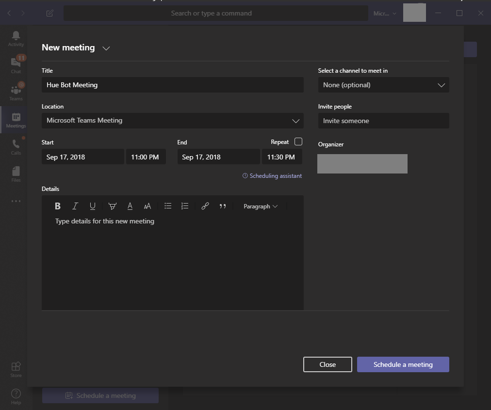

# Introduction

## About

The AudioVideoPlaybackBot sample guides you through building, deploying and testing an application hosted media bot. This sample demonstrates how a bot can do a video stream and change screen sharing role.

## Getting Started

This section walks you through the process of deploying and testing the sample bot.

### Bot Registration

1. Follow the steps in [Register Calling Bot](https://microsoftgraph.github.io/microsoft-graph-comms-samples/docs/articles/calls/register-calling-bot.html). Save the bot name, bot app id and bot secret for configuration.

1. Add the following Application Permissions to the bot:

    * Calls.AccessMedia.All
    * Calls.Initiate.All
    * Calls.JoinGroupCall.All
    * Calls.JoinGroupCallAsGuest.All
   
1. The permission needs to be consented by tenant admin. Go to "https://login.microsoftonline.com/common/adminconsent?client_id=<app_id>&state=<any_number>&redirect_uri=<any_callback_url>" using tenant admin to sign-in, then consent for the whole tenant.

### Prerequisites

* Install the prerequisites:
    * [Visual Studio 2017+](https://visualstudio.microsoft.com/downloads/)
    * [PowerShell] 7.0+
    * [Mirosoft Azure Subscription] (Can register for a <a href="https://azure.microsoft.com/en-us/free/" target="_blank">free account</a>)
    * [PostMan](https://chrome.google.com/webstore/detail/postman/fhbjgbiflinjbdggehcddcbncdddomop)

### Deploy

#### [Azure] deployment
##### Cloud Service (classic) [Planned Deprecation]
1. Create a cloud service (classic) in Azure. Get your "Site URL" from Azure portal, this will be your DNS name and CN name for later configuration, for example: `bot.contoso.com`.

1. Set up SSL certificate and upload to the cloud service
    1. Create a wildcard certificate for your service. This certificate should not be a self-signed certificate. For instance, if your bot is hosted at `bot.contoso.com`, create the certificate for `*.contoso.com`.
    2. Upload the certificate to the cloud service.
    3. Copy the thumbprint for later.

1. Set up cloud service configuration
    1. Open powershell, go to the folder that contains file `configure_cloud.ps1`. The file is in the `Samples` directory.
    2. Run the powershell script with parameters 

        `.\configure_cloud.ps1 -p {path to project} -dns {your DNS name} -cn {your CN name, should be the same as your DNS name} -thumb {your certificate thumbprint} -bid {your bot name} -aid {your bot app id} -as {your bot secret}`

        For example:

        `.\configure_cloud.ps1 -p .\V1.0Samples\LocalMediaSamples\AudioVideoPlaybackBot\ -dns bot.contoso.com -cn bot.contoso.com -thumb ABC0000000000000000000000000000000000CBA -bid bot -aid 3853f935-2c6f-43d7-859d-6e8f83b519ae -as 123456!@#$%^`

1. Publish AudioVideoPlaybackBot from VS:
    1. Right click AudioVideoPlaybackBot, then click Publish.... Publish it to the cloud service you created earlier.

##### Automated VMSS deployment with Github Worflows
###### Deployment Script Pre-Reqs

* [PowerShell 7.0+](https://docs.microsoft.com/en-us/powershell/scripting/whats-new/what-s-new-in-powershell-70)
* [Azure Az PowerShell Module](https://docs.microsoft.com/en-us/powershell/azure/install-az-ps)
    * Install-Module -Name Az -Scope CurrentUser -Repository PSGallery -Force
* [GitHub CLI](https://cli.github.com/)
    * This is not a hard requirement, but will automate the step to save the secret in your repo.
* Must be an owner of the Azure subscription where you are deploying the infrastructure.
* Must have permissions to create an Azure AD Application.
* Note: The Azure Bot must be created in a tenant where you are an adminstrator because the bot permissions require admin consent. The bot infrastructure does not need to be in the same tenant where the Azure bot was created. This is useful if you are not an administrator in your tenant and you can use a separate tenant for the Azure Bot and Teams calling.

| Secret Name          | Message |
| -------------------- |:-------------|
| localadmin           | 'localadmin' is the username for the admin on the provisioned VMSS VMs. The password entered is the password to login and will be configured for all VMs. |
| AadAppId             | This is the Azure AD Application Client Id that was created when creating an Azure Bot. Refer to the [registration instructions](https://microsoftgraph.github.io/microsoft-graph-comms-samples/docs/articles/calls/register-calling-bot.html) |
| AadAppSecret         | Client Secret created for the Azure AD Application during the Azure Bot registration. |
| ServiceDNSName       | Your public domain that will be used to join the bot to a call (ie bot.example.com) |
<br/>

###### Installation
1. Set up SSL certificate and upload to the cloud service
    1. Create a wildcard certificate for your service. This certificate should not be a self-signed certificate. For instance, if your bot is hosted at `bot.contoso.com`, create the certificate for `*.contoso.com`.
    2. Copy the path to the PFX certificate
        1. Install [OpenSSL](https://slproweb.com/products/Win32OpenSSL.html) to convert the certifcate from PEM to PFX
1. Navigate to the root directory of the sample in PowerShell.
1. Run `Get-AzContext` to ensure you are deploying to the correct subscription.
    1. You need to have the owner role on the subscription
    2. You need permissions to create a Service Principal
1. Run .\deploy.ps1 -OrgName <Your 2 - 7 Character Length Letter Abbreviation>
    1. - ie .\deploy.ps1 -OrgName TEB -Location eastus2
```powershell
    # Option 1 Run setup to deploy
    . .\deploy.ps1 -orgName <yourOrgName> -Location centralus
    # Option 1 Example
    . .\deploy.ps1 -orgName DNA -Location centralus
    
    # Option 2 Re-execute setup
    . .\deploy.ps1 -orgName <yourOrgName> -Location centralus -RunSetup
    # Option 2 Example
    . .\deploy.ps1 -orgName DNA -Location centralus -RunSetup
    
    # Option 3a Deploy from the commandline
    . .\deploy.ps1 -orgName <yourOrgName> -Location centralus -RunDeployment
    # Option 3a Example
    . .\deploy.ps1 -orgName DNA -Location centralus -RunDeployment

    # Option 3b Automated GitHub workflow
    The deployment will exectute via GitHub workflow
    - You can also manually run the 'BUILD' workflow to build the code
    - You can also manually run the 'INFRA' workflow after the previous workflow to deploy the infrastructure
```
###### Script Internals:
The deployment script uses ADF (Azure Deployment Framework) under the path AudioVideoPlaybackBot\ADF. This folder has template and boilerplate code files that are used to define the github workflow actions and define the infrastructure resources required to deploy the bot and install it using DSC extensions.

1. Create a resource group with the naming convention ACU1-TEB-BOT-RG-D1 (Region Abbreviation - Your Org Name - BOT - Resource Group - Environment)
2. Create a storage account
    - Grant current user the 'Storage Blob Data Contributor' role
    - Grant the service principal the 'Storage Blob Data Contributor' role
3. Create a Key Vault
    - And grant current user the 'Key Vault Administrator' role
4. Create an Azure AD Application
    - The Application will be granted the 'Owner' role to the subscription.
5. Crete a GitHub Secret wiht name AZURE_CREDENTIALS_<YOURORGNAME>_BOT
    ```json
    {
        "clientId": "<GitHub Service Principal Client Id>",
        "clientSecret": "<GitHub Service Principal Secret>",
        "tenantId": "<Tenant ID>",
        "subscriptionId": "<Subscription ID>",
        "activeDirectoryEndpointUrl": "https://login.microsoftonline.com",
        "resourceManagerEndpointUrl": "https://management.azure.com/",
        "activeDirectoryGraphResourceId": "https://graph.windows.net/",
        "sqlManagementEndpointUrl": "https://management.core.windows.net:8443/",
        "galleryEndpointUrl": "https://gallery.azure.com/",
        "managementEndpointUrl": "https://management.core.windows.net/"
    }
    ```
5. Generate the deployment parameters file, build workflow and infrastructure workflow
6. Upload the PFX certificate to Key Vault
7. Add the secrets and environment variables to Key Vault

After the script runs successfully, you should see the following:
1. New resource group with the following resources:
    - Storage Account
    - Key Vault
2. Azure AD Application in Azure AD
3. In your GitHub Repo, Navigate to Settings > Secrets. You should see a new secret named 'AZURE_CREDENTIALS_<YOURORGNAME>_BOT'
4. Three new files have been created. Check these files in and push them to your repo.
    - app-build-<YourOrgName>.yml
    - app-infra-release-<YourOrgName>.yml
    - azuredeploy<YourOrgName>.parameters.json
5. Once these files have been pushed to your repo, they will kick of the infrastructure and code deployment workflows.

###### Infrastructure Deployment 

The GitHub Action app-infra-release-<YourOrgName>.yml deploys the infrastructure.

You can also run the infrastructure deployment locally using the -RunDeployment flag.
```
.\deploy.ps1 -OrgName TEB -RunDeployment
```
###### Update DNS

Your DNS Name for your bot needs to point to the public load balacer in order to call your bot and have it join a meeting.

1. Find the public IP resource for the load balancer and copy the DNS name.
2. Navigate to your DNS settings for your domain and create a new CNAME record.
    ie CNAME bot acu1-teb-bot-d1-lbplb01-1.eastus2.cloudapp.azure.com

###### Deploy the Solution

The GitHub Action app-build-<YourOrgName>.yml builds the solution and uploads the output to the storage account. 
Once the infrastructure is deployed, DSC will pull the code from the storage account.

### Test

1. Schedule a Teams meeting with another person.

    

1. Copy the Join Microsoft Teams Meeting link. Depending on where you copy this, this may be encoded as a safe link in Outlook.

    

    Example, `https://teams.microsoft.com/l/meetup-join/19:cd9ce3da56624fe69c9d7cd026f9126d@thread.skype/1509579179399?context={"Tid":"72f988bf-xxxx-xxxx-xxxx-xxxxxxxxxxxx","Oid":"550fae72-xxxx-xxxx-xxxx-xxxxxxxxxxxx","MessageId":"1536978844957"}`

1. Join the meeting from the Teams client.

1. Interact with your service, _adjusting the service URL appropriately_.
    1. Use Postman to post the following `JSON` payload.

        ##### Request
        ```http
        POST https://bot.contoso.com/joinCall
        Content-Type: application/json
        {
            "JoinURL": "https://teams.microsoft.com/l/meetup-join/...",
        }
        ```

        ##### Response
        The guid "491f0500-401f-4f11-8af4-2eff4c0a0643" in the response will be your call id. Use your call id for the next request.
        ```json
        {
            "legId": "491f0500-401f-4f11-8af4-2eff4c0a0643",
            "scenarioId": "98ca8eab-8c03-4b7d-a468-15b37c0b648e",
            "call": "https://bot.contoso.com:10100/calls/491f0500-401f-4f11-8af4-2eff4c0a0643",
            "logs": "https://bot.contoso.com:10100/logs/491f0500-401f-4f11-8af4-2eff4c0a0643",
            "changeScreenSharingRole": "https://bot.contoso.com:10100/calls/491f0500-401f-4f11-8af4-2eff4c0a0643/changeRole"
        }
        ```

    1. After the bot joins the meeting. The bot will start playing a video. Change the bot's screen sharing role by `POST` changeRole request. Replace the call id 491f0500-401f-4f11-8af4-2eff4c0a0643 below with your call id from the first response.

        ##### Request
        ```http
        POST https://bot.contoso.com/calls/491f0500-401f-4f11-8af4-2eff4c0a0643/changeRole
        Content-Type: application/json
        {
            "role": "viewer"
        }
        ```
        You can play around with the bot by switching the screensharing role from "viewer" to "sharer" or from "sharer" to "viewer"

    1. Get diagnostics data from the bot. Open the links in a browser for auto-refresh. Replace the call id 491f0500-401f-4f11-8af4-2eff4c0a0643 below with your call id from the first response.
       * Active calls: https://bot.contoso.com/calls
       * Service logs: https://bot.contoso.com/logs

    1. Terminating the call through `DELETE`. Replace the call id 491f0500-401f-4f11-8af4-2eff4c0a0643 below with your call id from the first response.

        ##### Request
        ```http
        DELETE https://bot.contoso.com/calls/491f0500-401f-4f11-8af4-2eff4c0a0643
        ```
