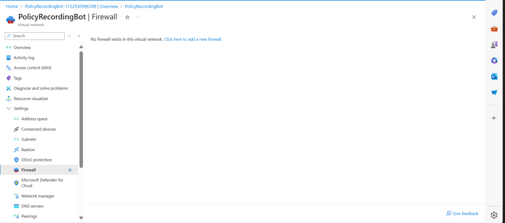

# Steps to Configure Azure Firewall
=====================================

## Step 1: Create a Virtual Network and Subnet for Azure Firewall

1. Go to Virtual Network or create a new one if it doesn't exist.
2. Create a subnet for the firewall with the purpose set to "Azure Firewall". 
3. Go to the firewall section and click on "Add firewall". 

## Step 2: Configure Firewall Settings

1. Choose a name for the firewall (e.g., "MyFirewall").
2. Create a new firewall policy. 
3. Select the existing Virtual Network.
4. Create a new public IP address (e.g., "MyFWPublicIP").
5. Review and create the firewall.

## Step 3: Configure Firewall Policy

1. Open the firewall policy created in Step 2.
2. Navigate to Settings.

### Configure Application Rules (Ingress)

1. Add an application rule:
    * Give a descriptive name.
    * Select "Application rule collection" as the rule type.
    * Assign the lowest number as the priority.
    * Specify a name for the rule.
    * Define the source (e.g., your VM subnet) or use `*` to allow all IP addresses.
    * Allow specific domains (e.g., `policyrecordingbot.eastus.cloudapp.azure.com`).
    * Save the rule.

### Configure Network Rules (Egress)

1. Add a network rule:
    * Give a descriptive name.
    * Select "Network rule collection" as the rule type.
    * Assign the lowest number as the priority.
    * Specify a name for the rule.
    * Define the source (e.g., your VM subnet) or use `*` to allow all IP addresses.
    * Specify external IPs or ranges (e.g., `0.0.0.0/0` for all).
    * Specify allowed protocols and ports.(TCP: 5060, 5061 ,UDP: 10000-20000)
    * Save the rule.