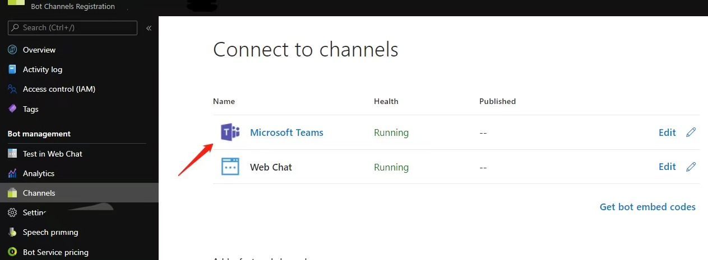

# Introduction

## Note

The system will load the bot and join it to appropriate calls and meetings in order for the bot to enforce compliance with the administrative set policy.
This sample is only designed for compliance recording scenario. Do not use it for any other scenarios.

## About

The Policy Recording bot sample guides you through building, deploying and testing a bot. This sample demonstrates how a bot can receive media streams for recording. Please note that the sample does not actually record. This logic is left up to the developer.

## Getting Started

This section walks you through the process of deploying and testing the sample bot.

### Bot Registration

1. Follow the steps in [Register Calling Bot](https://microsoftgraph.github.io/microsoft-graph-comms-samples/docs/articles/calls/register-calling-bot.html). Save the bot name, bot app id and bot secret for configuration.
    * For the calling webhook, by default the notification will go to https://{your domain}/api/calling. This is configured with the `CallSignalingRoutePrefix` in [HttpRouteConstants.cs](FrontEnd/Http/Controllers/HttpRouteConstants.cs).
    * Ignore the "Register bot in Microsoft Teams" section as the Policy Recording bot won't be called directly. These bots are related to the policies discussed below, and are "attached" to users, and will be automatically invited to the call.

1. Add the following Application Permissions to the bot:

    * Calls.AccessMedia.All
    * Calls.JoinGroupCall.All
   
1. The permission needs to be consented by tenant admin. Go to "https://login.microsoftonline.com/common/adminconsent?client_id=<app_id>&state=<any_number>&redirect_uri=<any_callback_url>" using tenant admin to sign-in, then consent for the whole tenant.

### Create an Application Instance

Open powershell (in admin mode) and run the following commands. When prompted for authentication, login with the tenant admin.
  * `Import-Module MicrosoftTeams`
  * `Connect-MicrosoftTeams` 
  * `New-CsOnlineApplicationInstance -UserPrincipalName <upn@contoso.com> -DisplayName <displayName> -ApplicationId <your_botappId>`
  * `Sync-CsOnlineApplicationInstance -ObjectId <objectId>`

### Create a Recording Policy
Requires the application instance ID created above. Continue your powershell session and run the following commands.
  * `New-CsTeamsComplianceRecordingPolicy -Enabled $true -Description "Test policy created by <yourName>" <policyIdentity>`
  * ```Set-CsTeamsComplianceRecordingPolicy -Identity <policyIdentity> -ComplianceRecordingApplications ` @(New-CsTeamsComplianceRecordingApplication -Parent <policyIdentity> -Id <objectId>)```

After 30-60 seconds, the policy should show up. To verify your policy was created correctly:
  * `Get-CsTeamsComplianceRecordingPolicy <policyIdentity>`

### Assign the Recording Policy
Requries the policy identity created above. Contine your powershell session and run the following commands.
  * `Grant-CsTeamsComplianceRecordingPolicy -Identity <userUnderPolicy@contoso.com> -PolicyName <policyIdentity>`

To verify your policy was assigned correctly:
  * `Get-CsOnlineUser <userUnderPolicy@contoso.com> | ft sipaddress, tenantid, TeamsComplianceRecordingPolicy`

### Prerequisites

* Install the prerequisites:
    * [Visual Studio 2017+](https://visualstudio.microsoft.com/downloads/)
    * [PostMan](https://chrome.google.com/webstore/detail/postman/fhbjgbiflinjbdggehcddcbncdddomop)

### Deploy

1. Prerequisites for deploying Azure Cloud Service (extended support)(https://learn.microsoft.com/en-us/azure/cloud-services-extended-support/deploy-prerequisite#required-service-configuration-cscfg-file-updates)
   * Lock Down Your Certificates with Azure Key Vault
      Create an Azure Key Vault to securely store and manage certificates for your cloud service. Follow these steps to create Azure Key Vault: https://learn.microsoft.com/en-us/azure/key-vault/general/quick-create-portal
   
   * Set up SSL certificate and upload to the Azure Key Vault
        1. Get a Wildcard Certificate: Create a wildcard certificate for your service (e.g., *.contoso.com if your bot is hosted at bot.contoso.com). Make sure it's not self-signed!
        2. Upload to Azure Key Vault: Upload the certificate to your Azure Key Vault.(stpes  on how to upload certificate in azure portal https://learn.microsoft.com/en-us/azure/key-vault/certificates/tutorial-import-certificate?tabs=azure-portal)
        3. Grab the Thumbprint: Copy the thumbprint and add it to your .cscfg files.

   * Set Up Your Virtual Network
      Create a virtual network and subnets in the Azure portal. Add the virtual network details to your .cscfg file. Follow these steps to  create  virtual network: https://learn.microsoft.com/en-us/azure/virtual-network/quick-create-portal

2. Create Your Cloud Service (extended support)
    Create a cloud service (extended support) in Azure (https://learn.microsoft.com/en-us/azure/cloud-services-extended-support/deploy-portal). Get your "Site URL" from the Azure portal, which will be your DNS name and CN name for later configuration (e.g., bot.contoso.com).

3. Set up cloud service configuration
    1. Open powershell, go to the folder that contains file `configure_cloud.ps1`. The file is in the `Samples` directory.

    2. Run the powershell script with parameters:
        ` .\configure_cloud.ps1 -p {path to project} -dns {your DNS name} -cn {your CN name, should be the same as your DNS name} -thumb {your certificate thumbprint} -bid {your bot name} -aid {your bot app id} -as {your bot secret}`
        
        For example:
        
         `.\configure_cloud.ps1 -p .\V1.0Samples\LocalMediaSamples\PolicyRecordingBot\ -dns bot.contoso.com -cn bot.contoso.com -thumb ABC0000000000000000000000000000000000CBA -bid bot -aid 3853f935-2c6f-43d7-859d-6e8f83b519ae -as 123456!@#$%^`

4. Publish the bot from VS:
    1. Right click PolicyRecordingBot, then click `Publish...`. Publish it to the cloud service(extended support) you created earlier.      

### Test

1. Set up the test meeting and test clients:
   1. Sign in to Teams client with a non-recorded test tenant user.
   2. Use another Teams client to sign in with the recorded user. You could use an private browser window and open up https://teams.microsoft.com. If the call notification doesn't appear on web, use the Teams desktop client.

2. Place a call from the Teams client with the non-recorded user to the recorded user.

3. Your recording bot should receive the incoming call and join the call immediately. Use the recorded users' Teams client to accept the call. Once the P2P call is established, you'll see a banner indicating that the recording has started. See the next step to learn how you can retrieve the call log.
     

3. Interact with your service, _adjusting the service URL appropriately_.
    1. Get diagnostics data from the bot. Open the url https://bot.contoso.com:10101/calls in a browser for auto-refresh. Search for the most recent CallId and replace with it in the below url.
       * Active calls: https://bot.contoso.com:10101/calls/{CallId}
       * Service logs: https://bot.contoso.com:10101/logs

    2. Terminating the call through `DELETE`, as needed for testing. Replace the {CallId} below with your call id from the first response.

        ##### Request
        ```json
            DELETE https://bot.contoso.com/calls/{CallId}
        ```
### Frequently Asked Questions:

1. **Question**: Call was forwarded to voiceMail directly instead of calling.

    **Solution**: Make sure Microsoft Teams Channel is enabled under Bot Channels Registration.
    

2. **Question**: Answering incoming call notification taking too long resulting in call not found error.
    
    **Solution**: Policy Recording scenario has a rather small timeout window set to receive answer from the bot, in order to make sure user can have time to pick up the call after bot joins the call.
    Something to consider to improve the performance of answering incoming call:
    1. Make sure the AAD token used to authenticate outbound request is cached, instead of acquiring one everytime.
    2. Make sure the bot server is located in the same geo-region as the user.

3. **Question**: How to migrate to grouping mode?

    **Solution**:
    1. Answer the call with **participantCapacity** to specify the capacity of how many policy-based users this bot instance can handle as a group. If the bot passes null or a value of 0 or 1, it means that the bot does not support grouping. We expect the participantCapacity to be quite large, like 100 or more.
   ```csharp
   await ICall.AnswerAsync(mediaSession: mediaSession, participantCapacity: capacity);
   ```
    2. Handle user joining in same group by hooking **ParticipantJoiningHandler**.
      * Accept join by returning **AcceptJoinResponse**.
    ```csharp
    ICall.ParticipantJoiningHandler = (call) => {
      // your logic
      return new AcceptJoinResponse();
    }
    ```
      * Redirect to new bot instance by returning **InviteNewBotResponse** with **InviteUri**.
    ```csharp
    ICall.ParticipantJoiningHandler = (call) => {
      // your logic
      return new InviteNewBotResponse() { InviteUri = “https://redirect.url/” };
    }
    ```
      * Reject by returning **RejectJoinResponse** with **Reason**.
    ```csharp
    ICall.ParticipantJoiningHandler = (call) => {
      // your logic
      return new RejectJoinResponse() { Reason = “Busy” };
    }
    ```
    3. Handle user left by hooking **ParticipantLeftHandler**.
    ```csharp
    ICall.ParticipantLeftHandler = (call, participantId) => {
      // your logic
    }
    ```