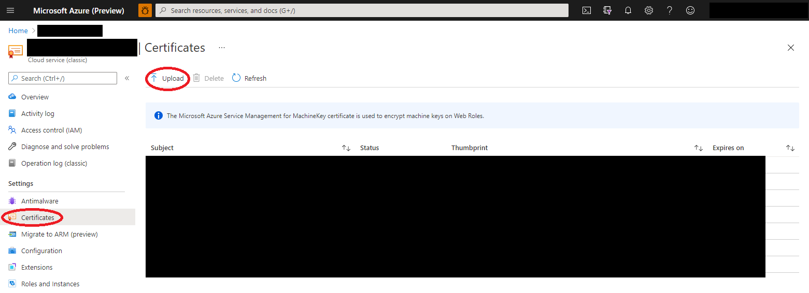
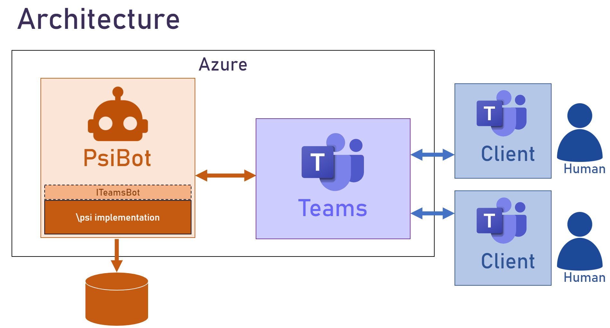

# Teams Bots with Platform for Situated Intelligence

Teams bots can be developed which participate in Teams meetings much the same way humans do; joining calls, consuming participant video and audio streams, and producing their own audio and video as well as screen sharing streams. These bots are typically deployed in Azure as automated agents.

[Platform for Situated Intelligence (\psi)](https://github.com/microsoft/psi) is an open, extensible framework for development and research of multimodal, integrative-AI systems. The framework is particularly well-suited for developing AI systems that perform audio-visual processing in real-time interactions.

In order to help accelerate the development of Teams bots with real-time audio and video capabilities, we have created this sample application which shows how you can integrate \psi with the Teams bot architecture to develop bots that can participate in live meetings, [visualize and debug](https://github.com/microsoft/psi/wiki/Psi-Studio) your implementation, and iterate quickly offline from persisted data.

This is a sample Teams bot implementation, and may be used as a starting point for creating bots of your own with \psi. In particular, this sample consumes participant audio and video streams and visualizes engagement by producing a screen-share video stream with a ball gravitating towards the most recently active speakers (partially inspired by [this research](https://www.media.mit.edu/publications/meeting-mediator-enhancing-group-collaboration-and-leadership-with-sociometric-feedback/)). This sample was announced at a virtual Platform for Situated Intelligence workshop, and the recording of that session can be found [here](https://youtu.be/7Wh4Xr1Bazg?t=8582).


# Getting Started

If you are not familiar with Platform for Situated Intelligence, you'll first want to acquaint yourself with some of the fundamental concepts. The [GitHub page](https://github.com/microsoft/psi) has lots of documentation for familiarizing yourself with the framework, including a [wiki](https://github.com/microsoft/psi/wiki), [samples](https://github.com/Microsoft/psi-samples), [tutorials](https://github.com/microsoft/psi/wiki/Tutorials), and more. A great place to get started is the [Brief Introduction](https://github.com/microsoft/psi/wiki/Brief-Introduction) tutorial.

In the next steps, we'll walk through how to initialize your bot and other necessary resources in Azure, and how to deploy this sample implementation to your bot from Visual Studio.

## Bot Registration

1. Follow the steps in [Register Calling Bot](https://microsoftgraph.github.io/microsoft-graph-comms-samples/docs/articles/calls/register-calling-bot.html). Save the bot __name__, __app id__, and __app secret__ for configuration later.

1. Add the following Application Permissions to the bot:

    * Calls.AccessMedia.All
    * Calls.Initiate.All
    * Calls.JoinGroupCall.All
    * Calls.JoinGroupCallAsGuest.All
   
1. The permission needs to be consented by tenant admin. Go to "https://login.microsoftonline.com/common/adminconsent?client_id=<app_id>&state=<any_number>&redirect_uri=<any_callback_url>" using tenant admin to sign-in, then consent for the whole tenant.

## Setup Cloud Service and SSL Certificate

1. Create a [cloud service (classic)](https://docs.microsoft.com/en-us/azure/cloud-services/cloud-services-choose-me) in your [Azure portal](https://portal.azure.com). Get and save your "Site URL" from Azure portal, as this will be the DNS name and CN name you will use for later configuration. For example, it might look something like: `bot.contoso.com`.

1. Create an SSL certificate and upload to the cloud service
    1. Create a wildcard certificate for your service. This certificate should not be a self-signed certificate. For instance, if your bot is hosted at `bot.contoso.com`, create the certificate for `*.contoso.com`.
    1. Upload the certificate to the cloud service.
    
    1. Copy the thumbprint for later.

## Edit Configuration Files

To deploy this PsiBot sample, you'll need to manually edit a few configuration files with some of the values you saved in the steps above.

1. `WorkerRole/app.config` settings in the WorkerRole project need to be filled in:

    ```xml
    <add key="BotName" value="<bot_name>"/>
    <add key="AadAppId" value="<app_id>"/>
    <add key="AadAppSecret" value="<app_secret>"/>
    ```

1. The [`PsiBot.zip`](./PsiBot/PsiBot.zip) file contains icons and a `manifest.json` file. Unzip this, update the manifest, and rezip. Update the `"botId": "<insert_bot_id>"` with the your Bot ID.

    * In the Teams client, click Apps -> Upload a custom app, and upload [`PsiBot.zip`](./PsiBot/PsiBot.zip)

1. The ServiceConfigurationCloud.*.cscfg configuration files need to be updated. Replace `insert_name` with the DNS name of the service  you created above (e.g. `psi-teams-service.cloudapp.net`).

    ```xml
    <Setting name="ServiceDnsName" value="insert_name" />
    <Setting name="ServiceCNAME" value="insert_name" />
    ```

    Update the certificate Thumbprint (`insert_thumbprint`) with the certificate thumbprint.

    ```xml
    <Setting name="DefaultCertificate" value="insert_thumbprint" />
    <Certificate name="Default" thumbprint="insert_thumbprint" thumbprintAlgorithm="sha1" />
    ```

## Deploying the Bot

You should now have everything you need to deploy this bot sample using the resources you've setup in Azure.

1. In Visual Studio, right-click on [PsiBot](./PsiBot/PsiBot/PsiBot.ccproj) and select `Publish...`. Publish to the cloud service you created earlier.

# Architectural Overview



The following projects comprise this sample:

- [**PsiBot**](./PsiBot/PsiBot/) - This is the bot itself. It contains boilerplate code that handles all the mechanics of hosting a Teams bot in Azure. This is also where we embed our \psi implementation (inside the [FrontEnd](./PsiBot/PsiBot/FrontEnd/) project).
- [**TeamsBot**](./TeamsBot/) - This project simply contains the `ITeamsBot` interface, which is used to create your \psi pipeline that can be plugged into the Teams bot infrastructure directly (i.e., as a drop-in replacement inside [PsiBot/FrontEnd/](./PsiBot/PsiBot/FrontEnd/)) or used in offline testing ([`TeamsBotTester`](./TeamsBotTester/)).
- [**TeamsBotSample**](./TeamsBotSample/) - Contains two sample implementations of the `ITeamsBot` interface. Both of these examples consume participant audio and video and visualize engagement by producing a screen-share video stream, either via a "bouncing ball" or by scaling video thumbnails.
- [**TeamsBotDataConverter**](./TeamsBotDataConverter/) - is a tool to process recorded stores; compressing them for transfer out of Azure and splitting per-participant streams for individual visualization in PsiStudio.
- [**TeamsBotTester**](./TeamsBotTester/) - is an app to test `ITeamsBot` implementations offline from recorded data.


## Bot Code

The \psi-related code inside [PsiBot](./PsiBot/PsiBot/) can be found in a few different places incide the [`FrontEnd`](./PsiBot/PsiBot/FrontEnd/) project.
- `CallHandler.cs` handles calls with the Teams bot APIs. This is also where we instantiate our \psi pipeline, an exporter to write to, and our `ITeamsBot` implementation. All of these are passed to a `BotMediaStream`.
- `BotMediaStream.cs` handles all input and output between Teams and \psi. It listens to various "media received" events and passes to a `MediaFrameSouceComponent`.
- `MediaFrameSourceComponent.cs` is the primary source component in the \psi pipeline comprising our bot implementation. It essentially converts Teams media buffers into standard \psi audio buffers and image types, which can then be consumed by our bot implementation (e.g., as implemented in [`TeamsBotSample`](./TeamsBotSample/)).

## Usage

The bot is configured to join, interact with, and record meetings. The easiest way to arrange such a meeting is to sign into the web-based Teams (teams.microsoft.com) in an In-Private/Incognito tab. The bot may be told to join the meeting by pasting the meeting link at the management page (e.g. https://your-service.cloudapp.net/manage (see [ManagementPageController.cs](./PsiBot/FrontEnd/Http/Controllers/ManagementPageController.cs)). This page is also used to tell the bot to leave a meeting (otherwise the \psi store remains "live" forever). While in the meeting, the bot records to a \psi store within `C:\Psi` on a "Cloud services (classic)" machine.

Stores may be quite large. Running the [`TeamsBotDataConverter` tool](../../TeamsBotDataConverter/) on them will encode the video streams to reduce the size before transfer. Either way the stores may be used within the [`TeamsBotTester` app](../../TeamsBotTester/). The converter tool may also be used to split the per-participant streams of audio and video into individual streams to accommodate analysis in PsiStudio.

Please remember to develop and deploy your own bots in a responsible manner. In this sample, the bot displays a notice informing participants that all meeting data is being recorded. This is a good practice to follow: always let people who join the meeting know that their audio/video data is being sent to the bot (and perhaps recorded), and inform them about what the bot is doing with that data. For other guidelines and best practices, please see [this publication](https://www.microsoft.com/en-us/research/publication/responsible-bots/).

## Known Issues

- The frame rate of videos consumed by the bot can be quite low. Further investigation is needed to determine how/where this can be improved in the Teams bot APIs.
- Starting and stopping video doesn't resume the stream at the bot (leaving and rejoining does)
- Audio originating time may be 0 in the first 4-5 seconds of the call, or during various media events. See: https://microsoftgraph.github.io/microsoft-graph-comms-samples/docs/bot_media/Microsoft.Skype.Bots.Media.UnmixedAudioBuffer.html#Microsoft_Skype_Bots_Media_UnmixedAudioBuffer_ActiveSpeakerId