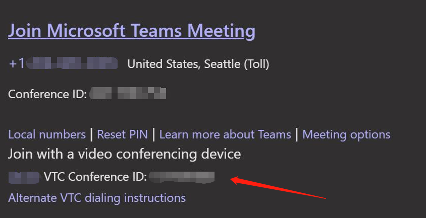

# Introduction
The sample demostrate an incident process workflow. When a incident raised (through a web API call to the bot), the bot will join a scheduled incident meeting, call incident responders, play audio prompt about the incident, and connect them to the incident meeting if they press "1". 

# Sample status
1. Other applications could call a web api to raise a incident process, with scheduled meeting information and incident resonders identities.
2. Bot join a scheduled meeting
3. Bot call incident responders
4. Play audio prompt message about the incident
5. Decode DTMF from incident responders
6. Connect the responders to incident meeting

# Getting Started
1.	Installation process
  * Enable an Azure subscription to host web sites and bot services. 
  * Install Visual Studio 2017
  * Launch IncidentBot.sln in <Repository>\RemoteMediaSamples with Visual Studio 2017 (VS2017)
  * Click menu Build/"Build Solution" to build the whole solution
  * Create web site in Azure
    - Right click IncidentBot/"Connected Services" and select "Add Connected Service" in project IncidentBot in VS2017, then select Publish tab, and click "Create new profile" to lauch a dialog
    - Select "App Service" then click "Create New" radio button, then click "Publish" button to create a App Service and publish the code on. 
    - Write down the web site root uri \{BotBaseUrl} for next steps.
  * Create an BotService in an Azure subscription with Azure Portal (https://portal.azure.com), then enable both Teams & Skype channels on the Azure portal, and configure the calling Uri of the bot. 
    - Go to "Bot Services" resource type page, click "Add", select "Bot Channels Registration", click "Create", then follow the instructions. 
      - Write down the application ID \{ApplicationId} and \{ApplicationSecret} for next steps. 
    - Click "IncidentBot" in "Bot Services" resource type page, Click "Channels", Then select "Microsoft Teams" and "Skype" channels and enable both of them.
    - Click "edit" button of "Skype" channel, click "Calling" tab, select "Enable calling" radio button, then select "IVR - 1:1 IVR audio calls", and fill the Webhook (for calling) edit box with value "\{BotBaseUrl}/callback/calling". 
  * Configure permissions for the Bot.
    - Go to Application Registration Portal (https://apps.dev.microsoft.com/).
    - Select your registered bot application.
    - Click "Add" under Microsoft Graph Permissions --> Application Permissions.
    - Select all permissions starting with "Calls.", i.e. "Calls.AccessMedia.All", "Calls.Initiate.All", etc.
    - Click "Ok" and then "Save"
  * Consent the permissions
    - Go to "https://login.microsoftonline.com/common/adminconsent?client_id=<app_id>&state=<any_number>&redirect_uri=<any_callback_url>"
    - Sign in with a tenant admin
    - Consent for the whole tenant.
  * Update the following elements in appsettings.json file in project IncidentBot.
    - Bot/AppId: "\{ApplicationId}"
    - Bot/AppSecret: "\{ApplicationSecret}"
    - Bot/BotBaseUrl: "\{BotBaseUrl}"
    - AzureAD/Domain: "\<reserved for later auth work, no need to change now>"
    - AzureAD/TenantId: "\<reserved for later auth work, no need to change now>"
    - AzureAD/AppId: "\<reserved for later auth work, no need to change now>"
    - AzureAD/AppSecret: "\<reserved for later auth work, no need to change now>"
  * Publish the application again. 
    - Right click IncidentBot/"Connected Services" and select "Add Connected Service" in project IncidentBot in VS2017, click "Publish" button.

2. Update process
  * Update code properly.
  * Publish the application again.

3.	Software dependencies
  * .NET Framework 471
  * Nuget packages list are in \<ProjectName>\Dependencies\Nuget in Solution Explorer of Visual Studio 2017
	
4.	Latest releases
  * version 0.2

5.	API references

# Build and Test
1. Create a tenant in O365, with Teams enabled. 

2. Create two users in O365, with Teams enabled. 
  * Write down the users' object IDs as \{UserObjectId-1} for user1 and \{UserObjectId-2} for user2.

3. Install Teams client.

4. Login Teams with user1. Create a teams channel and add a meeting there. 
  * Meeting uri should be in format https://teams.microsoft.com/l/meetup-join/... 

5. If the meeting created is a VTC meeting and **{videoTeleconferenceId}** is provided in request body, then **{videoTeleconferenceId}** will be used as a replacement of **{joinURL}**.
  

6. Use the postman to send request to "**{WebSiteRootUri}/incidents/raise**", with header "Content-Type:application/json" and the json content in body as below:
    ```json
    {
      "name": "<name-of-incident>",
      "time": "<start-time-of-the-incident-in-ISO-8601-format>",
      "tenantId": "{TenantId}",
      "objectIds": [
        "{UserObjectId-1}",
        "{UserObjectId-2}"
      ],
      "videoTeleconferenceId": "{VTC Conference ID}, alternative parameter",
      "joinURL": "https://teams.microsoft.com/l/meetup-join/..., alternative parameter",
      "removeFromDefaultRoutingGroup": true,
      "allowConversationWithoutHost": true
    }
    ```

6. user1 & user2 should get audio call, and bot should joined the schedule meeting. 

7. Choose user1 as a example(currently, user2's behaviors are same as user1's), when the call is picked up, user1 should be able to hear the audio prompt to notice an incident is occured, and press "1" or "0" for different actions.

8. If user1 pressed "1", an new invitation will be sent from the bot to invite user1 to join the incident meeting.
  * If Teams Client is in the P2P call panel layout with Incident Bot, user1 will join the Incident Meeting directly with "voice only" by default.
  * If Teams Client is in the menu layout with P2P call layout minimized on Top-left, user1 will received an invitation from Bot, with choices of "video" or "voice only" to join the incident meeting.

# Contribute
TODO: Explain how other users and developers can contribute to make your code better. 


